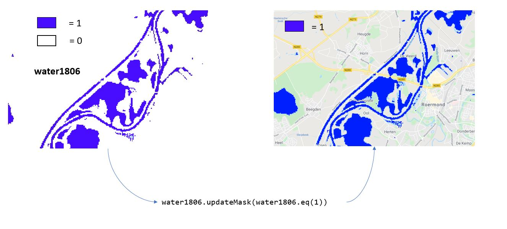

**Gegeven**: startscript met ROI met uit te voeren stappen
Link: [https://code.earthengine.google.com/7e9d4703332801ad0fee89d546cf1863](https://code.earthengine.google.com/7e9d4703332801ad0fee89d546cf1863)

**Gevraagd**: 
Visualisatie van het overstromingsgebied op 18/07/2021 (overstromingen) in vergelijking met toestand op 16/06/2021 (voor overstromingen)

**Tips:**  

   * Maak gebruik van de MNDWI-index voor een eenvoudig onderscheid tussen water en land.
    MNDWI formule ([Xu, 2005](tandfonline.com/doi/abs/10.1080/01431160600589179)):  

$$MNDWI = { GREEN - SWIR 1 \over GREEN + SWIR 1}.$$  

   * Zoek naar de geschikte MNDWI-waarden om water af te scheiden van de andere gebieden (= "*tresholding*")

   * Maak gebruik van de ```.updateMask()```-functie

!!! note "Over ```.updateMask```"
    De updateMask-functie maskeert een beeld, waar het 'mask'-beeld gelijk is aan 0 (m.a.w. gebruik je een binair beeld als 'mask', dan houdt je alle rasterwaarden over die overlappen met de '1'-waarde van je mask.

    Bijvoorbeeld: 
    <p align="center">
      <br>
    </p> 

??? check "Oplossing"
    Link: [https://code.earthengine.google.com/5eee98814a3dbe48f9a0da6312179e91](https://code.earthengine.google.com/5eee98814a3dbe48f9a0da6312179e91)