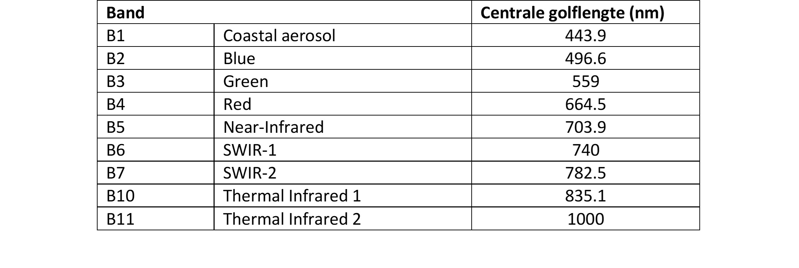

Fritz, een Duitse student Fernerkundung  aan de universiteit van Freiburg, is bezig aan een veldinventarisatie waarbij hij enkele landbekkingsklassen aan het inventariseren is. Bij thuiskomst realiseert Fritz zich echter dat hij zijn samples geen naam gegeven heeft en heeft bijgevolg beschikt over 4 locaties zonder label. Help jij hem de klassen opnieuw te onderscheiden?

### Gegeven 

  * Een startscript: [https://code.earthengine.google.com/7a184f3697db1574544bafd1b73e772e](https://code.earthengine.google.com/7a184f3697db1574544bafd1b73e772e)
     - Met 4 polygonen met onbekende landbekkingsklassen (genummerd op property class).
     -	Met afbakening van het studiegebied (ROI)

  * Fritz had volgende klassen geïnventariseerd:  

| class       | Label                                |
| ----------- | ------------------------------------ |
| `?`         | Loodbos |
| `?`         | Naaldbos |
| `?`         | Stad |
| `?`         | Water |

### Gevraagd

** Vraag 2.1 **:  
Fritz wenst een Valse Kleurencomposiet van zijn studiegebied, waarbij rekening wordt gehouden met volgende restricties:    

  * Een Landsat-8 beeld (Surface Reflectance, Tier 1 collectie)  
  * Gefilterd op de periode 1 juni 2019 t.e.m. 30 september 2019  
  * Gefilterd op het studiegebied (ROI)  
  * Wolken dienen worden te verwijderd uit de beelden.  
  * Voor elke pixel de mediane waarde van de overgebleven collectie  

**Vraag 2.2**:  
Ga na hoe je de 4 klassen spectraal van elkaar kan onderscheiden en illustreer dit a.d.h.v een grafiek. Verklaar. Kun je de 4 klassen correct toewijzen? Maak enkel gebruik van de noodzakelijke banden.

### Tip: centrale golflengtes Landsat 8

   

??? check "Oplossing"
    Link: [https://code.earthengine.google.com/3ad5b5e87ebbbfd859d103ab60fc4d2f](https://code.earthengine.google.com/3ad5b5e87ebbbfd859d103ab60fc4d2f)