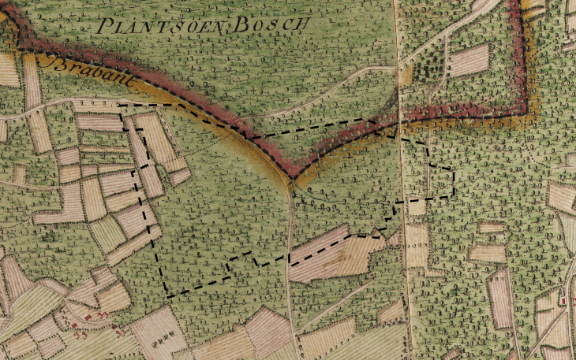

   

De kaarten van Ferraris (1771-1778) behoren tot de oudste systematische kartering in Vlaanderen. In volgende oefening berekenen we hoeveel van de 'Ferrarisbossen' ook vandaag nog bos zijn in Vlaams-Brabant.

**Gegeven**: startscript met de afbakening van West-Vlaanderen
Link: [https://code.earthengine.google.com/2aae622d98ae655bbfe263d8aed1edab](https://code.earthengine.google.com/2aae622d98ae655bbfe263d8aed1edab)

**Gevraagd**:  Bereken en visualiseer de oppervlakte van bossen die zowel in 2022 als op de Ferrariskaart al bos worden geclassificeerd.

**Stappen**:  

   * Maak een wolkenvrij sentinel-2 beeld van West-Vlaanderen voor 2022 aan, die je aanmaakt door:  
         - de sentinel-2 collectie te filteren op de zomerperiode 2022  
         - een maximale wolkbedekking van 30% te nemen.  
         - de resterende wolkbedekking te maskeren  
         - finaal een median-reducer toe te passen op de resterende beelden    

   * Classificeer je beeld in 2 klassen: bos en niet-bos met een classifier naar keuze. Maak hiervoor zelf je trainingsklassen aan. (Voor deze oefening hoef je geen accuraatsheidbepaling te doen). Visualiseer je resultaat.

   * Bepaal de opppverlakte van het bos dat zowel voorkomt op de Ferrariskaart als binnen je classificatie uit 2022 in hectare.

??? check "Oplossing"
    Link: [https://code.earthengine.google.com/387fed91db3979bf087dcc8591e5870a](https://code.earthengine.google.com/387fed91db3979bf087dcc8591e5870a)
    Opmerking: in deze oefening hebben we geen rekening gehouden met de definitie 'Bos' die het INBO gebruikt. Hierdoor ligt de inschatting bosoppervlakte hoger dan de inschatting van het INBO (7503 ha). Ook de bossen die tussen de jaren 1778 en 2022 werden gekapt maar terug bijgroeiden zijn in principe geen Ferrarisbos. Er zou nog extra historische kaartmateriaal gebruikt moeten worden om de bosoppervlakten te bepalen die ononderbroken bebost waren sinds de Ferrariskaarten.