## Het elektromagnetisch spectrum

Het aardoppervlak weerkaatst zonlicht. Hoeveel zonlicht hangt af van de specifieke kenmerken van het aardobject in kwestie zelf. Water bijvoorbeeld, weerkaatst zonlicht in het spectrum tot ongeveer 0.72 µm, maar absorbeert het zonlicht met grotere golflengtes quasi volledig. Elk voorwerp/landschapselement heeft op deze manier een specifieke ‘spectrale, waarbij het gereflecteerde zonlicht in functie staat met de golflengte. Onderstaande figuur geeft het klassieke voorbeeld weer van dergelijke spectrale signaturen voor water, bodem en (groene) vegetatie. 

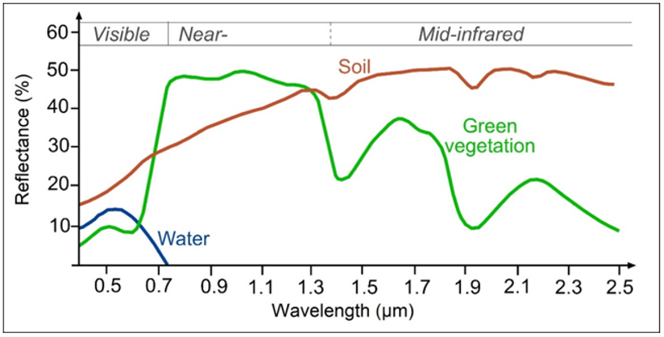
<em> Spectrale signatuur van water - vegetatie - bodem. </em>

 

!!! question "Oefening: het elektromagnetisch spectrum"
    **Vraag 2.1** - Welke golflengtes zijn niet geschikt bodem met groene vegetatie te onderscheiden?  
    **Vraag 2.2** - Binnen welke golflengtes zal water zwart lijken op het beeld?
    

Het menselijke oog kan enkel de golflengtes binnen de zone 0.4 µm tot 0.7 µm waarnemen (a.k.a. het zichtbaar licht). Optische satellieten daarentegen kunnen gereflecteerd zonlicht waarnemen tot de hogere golflengtes; het infrarode, ver-infrarode en thermische deel van het elektromagnetisch spectrum. Welk exact deel van het spectrum een sensor opneemt is afhankelijk van de sensor in kwestie. Elke satelliet is immers beperkt in spectrale gevoeligheid, ook wel spectrale resolutie genoemd. Hoe gevoeliger de sensor is aan kleine spectrale verschillen (kleine golflengte-intervallen), hoe hoger de spectrale resolutie. 

### Bandverdeling Sentinel-2

Laat ons enkele van de spectrale banden - die porties van het elektromagnetisch spectrum voorstellen - van het Sentinel-2 beeld verder inspecteren. Een Sentinel-2 beeld bevat in totaal 13 spectrale banden, met een spatiale resolutie van 10, 20 or 60m:  

<figure markdown>
  
  <figcaption>Bandverdeling van Sentinel-2, met de centrale golflengte en spatiale resoltie per band.</figcaption>
</figure>

<figure markdown>
  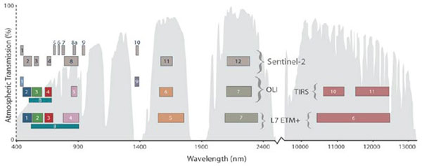
  <figcaption>Bandeverdeling van Sentinel-2, Landsat 8 en Landsat 7 t.o.v de golflengtes </figcaption>
</figure>

## Rastervisualisatie in QGIS
We hebben reeds een Sentinel-2 beeld gedownload. Nu kunnen we de verschillende banden van dit beeld ook gaan visualiseren, wat we doen met behulp van QGIS. QGIS is een open-source geografisch informatiesysteem, wat betekent dat het vrij te downloaden en te gebruiken is. Binnen de practica van Teledetectie gebruiken we het louter voor de visualisatie van de spectrale banden in Practicum 1, maar voor het vak Geografische Informatiesystemen (2e semester), wordt de software verder uitgediept.

!!! note "Oefening: het openen van Sentinel-2 rasterban in QGIS"
    * Unzip je gedownload Sentinel-2 beeld naar een folder naar keuze  
    * In QGIS: open de Data Source Manager om data toe te voegen:   
    * Kies voor *Raster*   
    * Navigeer naar je gedownloade en Unzipte.SAFE-file  
    * Zoek naar Sentinel-2 Band 2 in 10m resolutie (*> GRANULE > L2A_... > IMG_DATA > .._B02_10m.jpg*) en voeg de band toe aan je project
    

    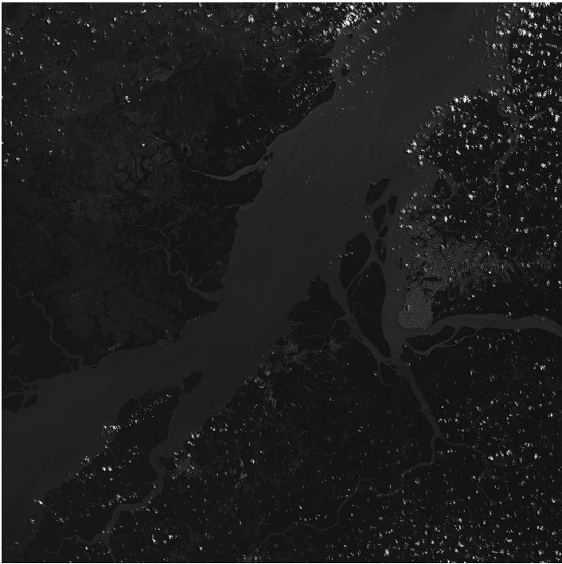
    
 

### Identifier
Als je klikt op het 'Identify'-symbooltje , kun je individuele pixelinformatie bekijken bij het klikken op je beeld. 

  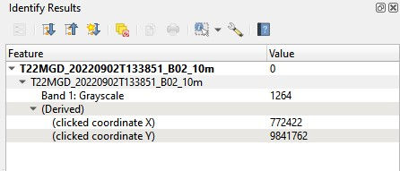  

 

!!! question "Oefening: het elektromagnetisch spectrum"
    **Vraag 2.4** - Vergelijk de pixelwaarde binnen band 2 van een wolkenpixel en een waterpixel. Wat betekent dit?

### Histogram

Een histogram is een grafische weergave van de statistieken die in relatie staan met de helderheid van het beeld. Het geeft een distributie weer van de grijswaarden binnen een beeld. Op de verticale as lees je de ‘hoeveelheid’ van een bepaalde grijswaarde (horiziontale as) dat zich binnen een beeld bevindt. 

Om het histogram van een band in te laden in QGIS;  
 
  * Klik met je rechtermuisknop op je beeld in het 'Layers' paneel 
  * Kies *Properties*, een nieuw venster wordt geopend.
  * Klik op de tab 'Histogram'
  * Om het histogram te visualiseren klik je *Compute Histogram*, je histogram wordt nu geladen

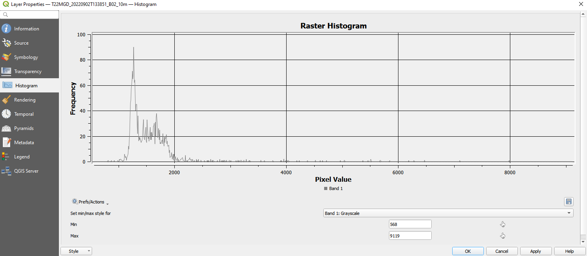

 

!!! question "Histogram"
    **Vraag 2.3** - Wat zijn de minimum-maximumwaarden van de huidige visualisatie?  
    **Vraag 2.4** - Binnen welke range van pixelwaarden bevinden meeste pixels in het beeld zich?

### Image Stretching (contrast verhoging)

**Image Stretching** is een techniek dat tracht om het contrast tussen de pixels in een beeld te verbeteren door het te ‘stretchen’ naar een nieuwe range van intensiteitswaarden. De keuze van deze range hangt af van de grondobjecten waar meer nuance nodig is, of waar de focus op ligt. 

Het beeld dat we momenteel hebben gevisualiseerd lijkt vrij donker, waarbij enkel de witte wolken duidelijk worden gevisualiseerd. Dit komt omdat de reflectiewaarden van wolken vele malen hoger ligt dat deze van andere landbedekkingsklassen (zoals te zien via de identifier en het histogram). 

Er bestaan 2 methoden om aan *image stretching* te doen binnen QGIS:  

  * **Optie 1: via het histogram**  
     Door het aanpassen van de Min/Max grenzen van de visualisatie binnen het Histogram-venster kun je aan image stretching doen. Dit kun je doen door visueel de range af te bakenen waar de meeste pixels binnen vallen.

  * **Optie 2: via de raster toolar**  
     Een handige tool is de Raster toolbar, die toelaat om op basis van je huidig *window view* stretching uit te voeren. Deze toolbar is standaard niet zichtbaar, maar kan worden toegevoegd via *View > Toolbars > Raster Toolbar*. Hoover even met je muis over de verschillende knoppen om na te gaan wat te verschillen zijn. Test ze tevens eens uit.

  

      
  
 

## Spectrale banden Sentinel-2

!!! note "Analyse: Spectrale banden Sentinel-2"
    Hieronder kun je een beschrijving terugvinden van de eigenschappen en gebruik per spectrale band van Sentinel-2. Visualiseer alle banden en tracht ook de verschillende landschapselementen terug te vinden, binnen elk van de banden.

  * **Band 2 - Blue - Resolution 10m**  
     Band 2 is useful for soil and vegetation discrimination, forest type mapping and identifying man-made features. It is scattered by the atmosphere, it illuminates material in shadows better than longer wavelengths, and it penetrates clear water better than other colors. It is absorbed by chlorophyll, which results in darker plants.

  * **Band 3 - Groen - Resolutie 10m**
     It gives excellent contrast between clear and turbid (muddy) water, and penetrates clear water fairly well. It helps in highlighting oil on water surfaces, and vegetation. It reflects green light stronger than any other visible color. Man-made features are still visible.

  * **Band 5/6/7 - Red-edge - Resolutie 20m**
     For classifying vegetation.

  * **Band 8 - NIR - Resolutie 10m**
     The near infrared band is good for mapping shorelines and biomass content, as well as at detecting and analyzing vegetation.

  * **Band 8 - narrow NIR - Resolutie 20m**
     The narrow near infrared band is a smaller portion of the NIR-range, to closely resemble the Landsat-8 NIR range.

  * **Band 9 - Water Vapour - Resolutie 60m**
     It is good for detecting water vapour.

  * **Band 10 - SWIR Cirrus - Resolutie 60m**
     For cirrus cloud detection.

  * **Band 11 - SWIR 1 - Resolutie 20m**
     It is useful for measuring the moisture content of soil and vegetation, and it provides good contrast between different types of vegetation. It helps differentiate between snow and clouds. On the other hand, it has limited cloud penetration..

  * **Band 12 - SWIR 2 - Resolutie 20m**
     It is useful for measuring the moisture content of soil and vegetation, and it provides good contrast between different types of vegetation. It helps differentiate between snow and clouds. On the other hand, it has limited cloud penetration.

## Oefening - Bandverdeling Landsat 8

???+ note "Oefening - Landsat 8 bandverdeling" 
    Link de verschillende Landsat-8 banden (in grijswaarden) met de overeenstemmende banden (zonder panchromatische band). Bekijk hiervoor de tabel met de Landsat-8 bandverdelingen het elektromagnetisch spectrum hierboven.

    Het gebied is de 'Greater Dublin Area'.

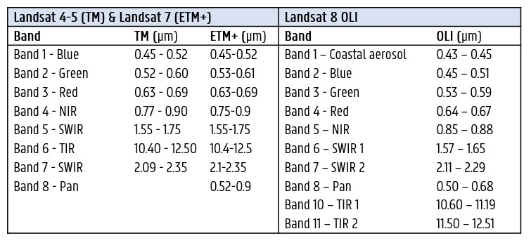  

 

<figure markdown>
  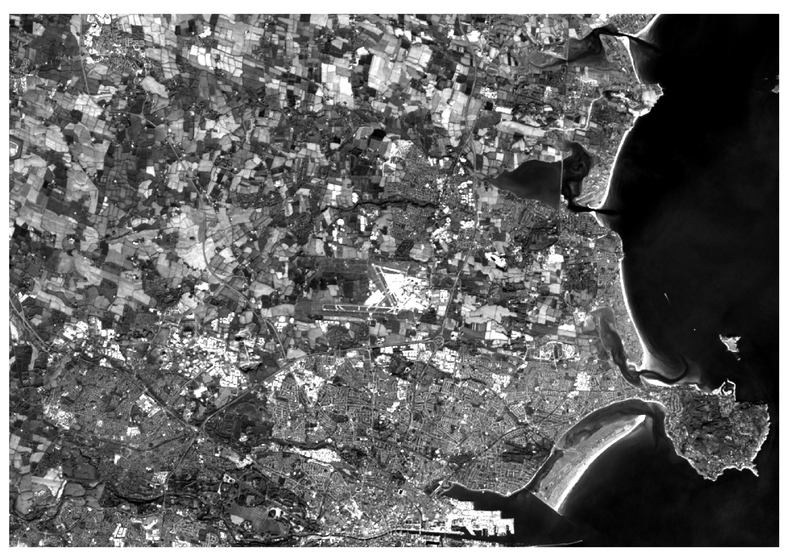
  <figcaption>A </figcaption>
</figure>

<figure markdown>
  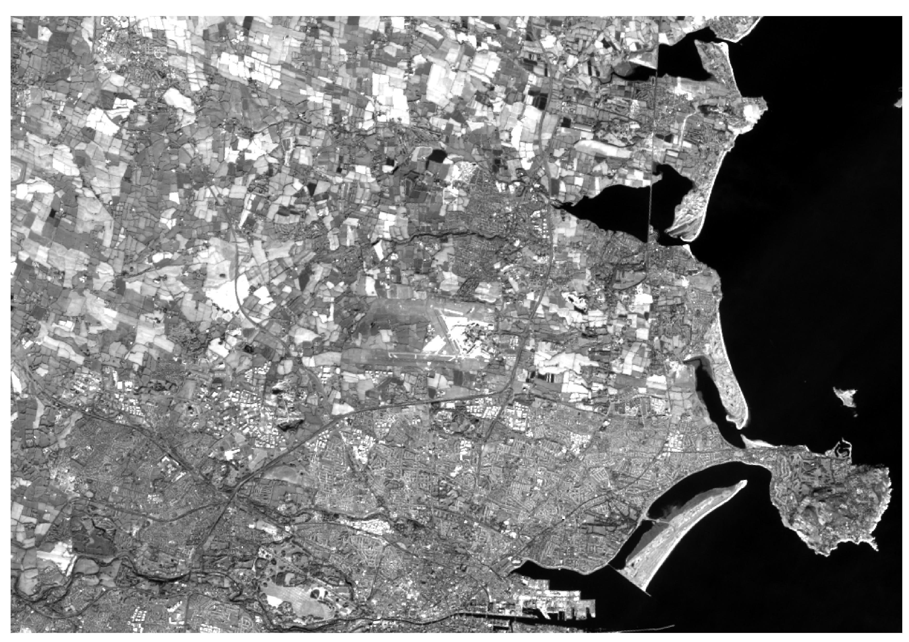
  <figcaption>B </figcaption>
</figure>

<figure markdown>
  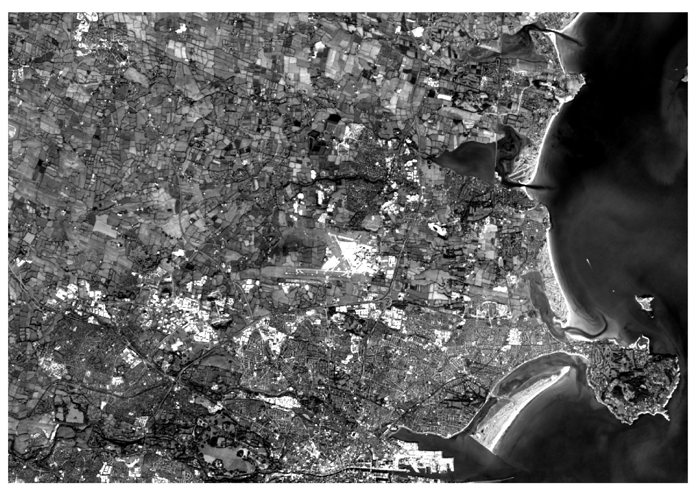
  <figcaption>C </figcaption>
</figure>

<figure markdown>
  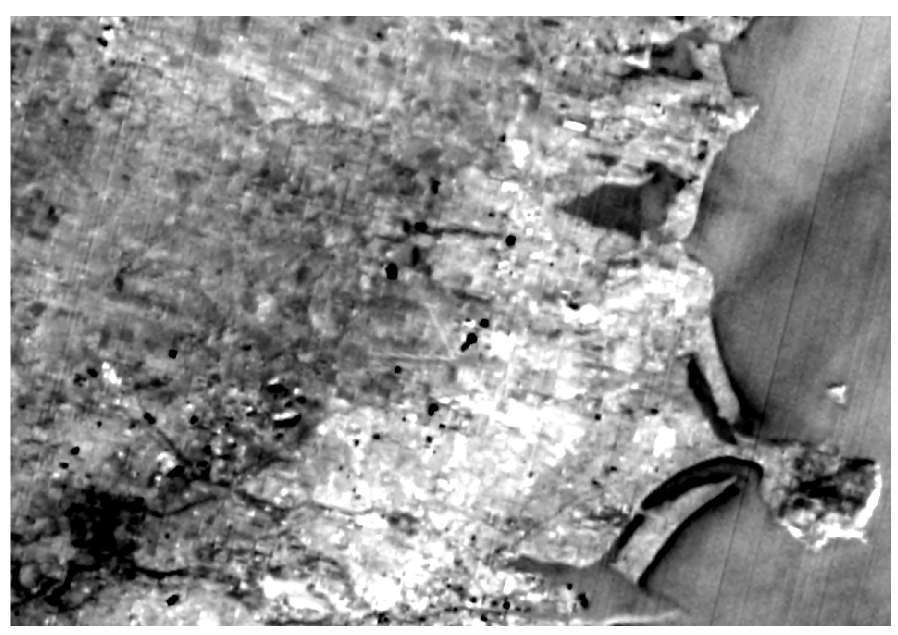
  <figcaption>D </figcaption>
</figure>

<figure markdown>
  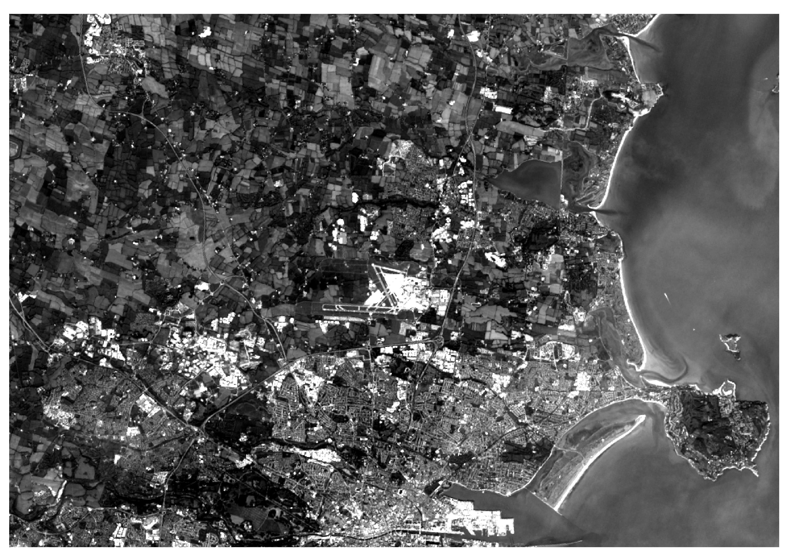
  <figcaption>E </figcaption>
</figure>

<figure markdown>
  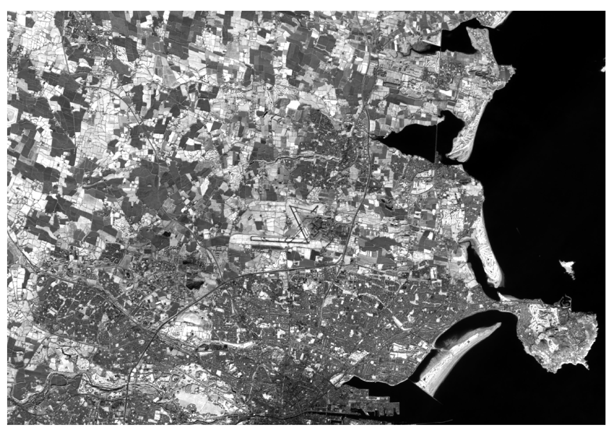
  <figcaption>F </figcaption>
</figure>

<figure markdown>
  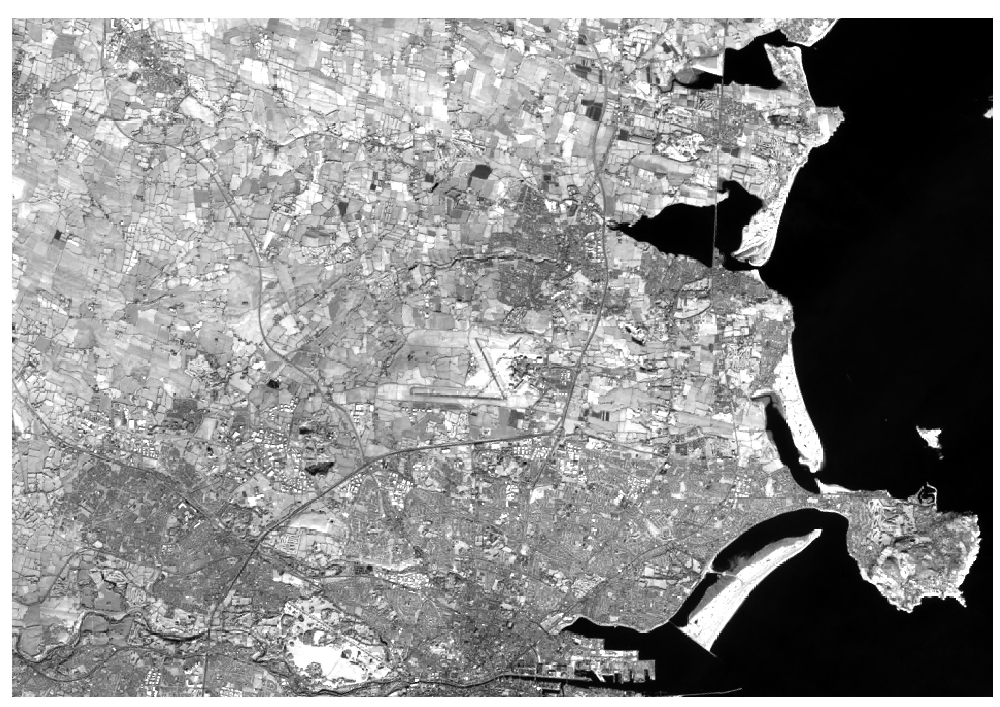
  <figcaption>G </figcaption>
</figure>

