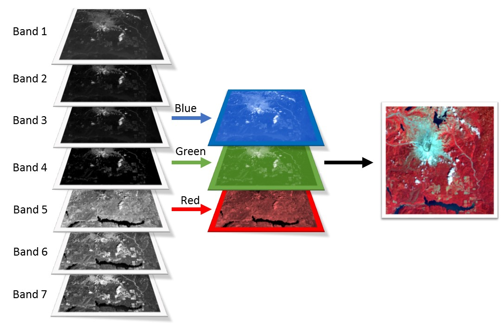
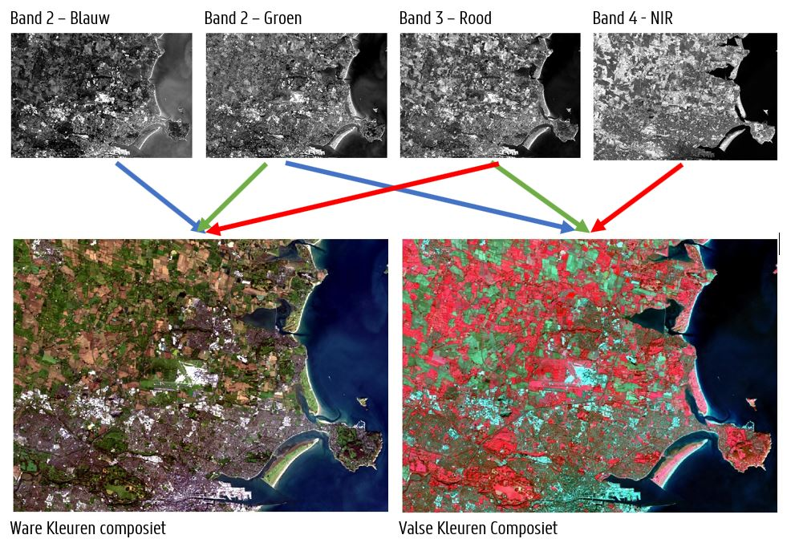
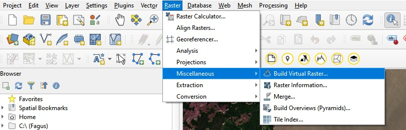
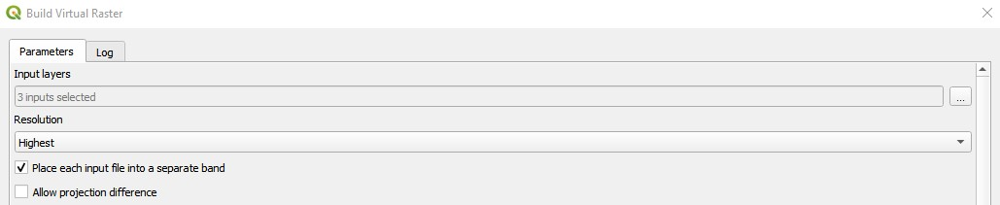
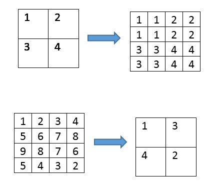
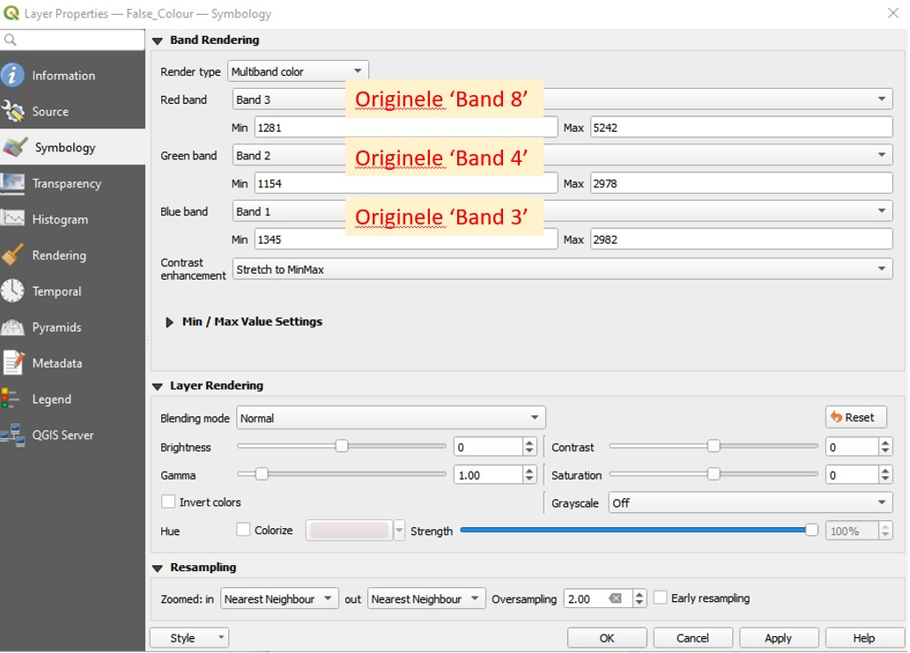
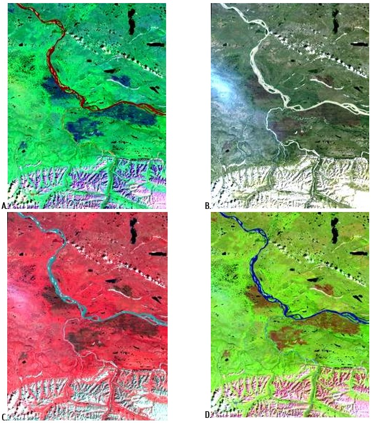
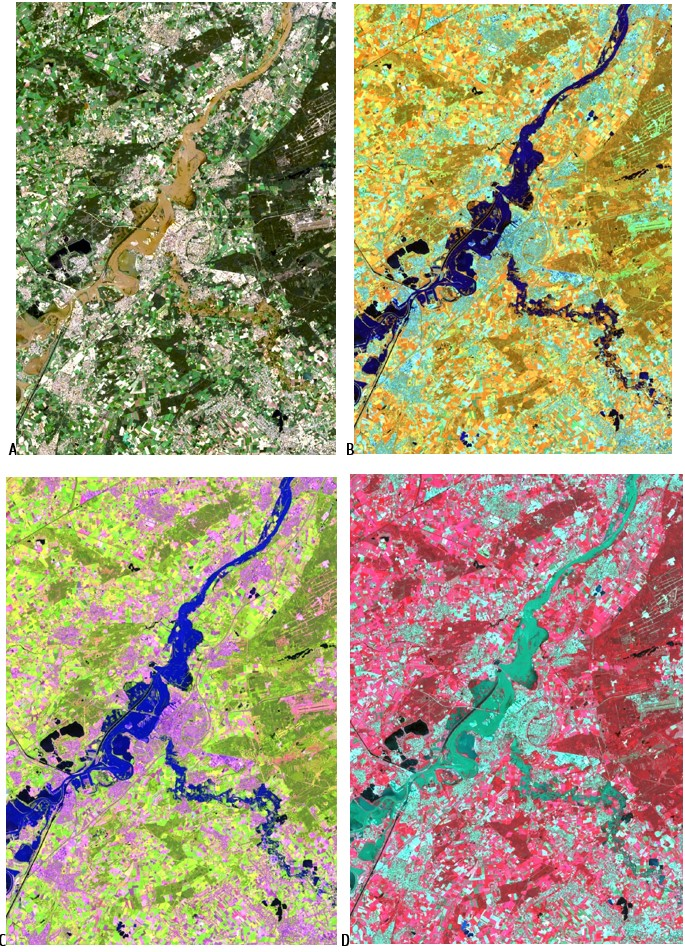

## Kleurcomposieten

Door combineren van verschillende banden tot één enkel beeld, kunnen beeldkenmerken duidelijk worden die daarvoor moeilijk te onderscheiden waren. Een beeld bestaat typisch uit 3 kleurbanden: de blauwe, groene en rode band. In een **ware of normale kleurencomposiet** (‘true color composite’) is het simpel: hier worden de blauwe, groene en rode band aan de overeenkomstige kleurbanden toegekend. Het resulterende beeld stemt dan overeen met hetgeen het menselijke oog waarneemt.  

Een ander veelgebruikte composiet is de **valse kleuren composiet** (‘false colour composite’), waarbij de groene, rode en infrarode band worden toegekend aan respectievelijk de blauwe, groene en rode kleur. In dit beeld krijgt vegetatie een rode kleur aangezien het een sterke reflectie kent binnen de NIR-band. Water krijgt een blauwe kleur, aangezien het sterk gereflecteerd wordt in de groene band (en meer wordt geabsorbeerd in rode/infrarood).

     
  <em>  </em>

 

     
  <em>  </em>

 

## Aanmaken van een beeldcomposiet in QGIS

Laat ons een eigen beeldcomposiet aanmaken in QGIS! Hiervoor laad je eerst de andere banden ook in je project.
Klik daarna op het menu-item *'Raster'> 'Miscellaneous' > 'Build Virtual Raster'*

    

 

Een nieuw scherm wordt getoond, waarbij je de keuze krijgt om banden toe te voegen. Kies hierbij voor de 3 banden waarvoor je een beeldcomposiet wenst te maken (bijvoorbeeld Band 8 (NIR), Band 4(Rood), Band 3 (Groen) bij het maken van een Valse Kleurencomposiet). De volgorde van de banden is hierbij van belang, deze kun je nog verslepen bij het toevoegen). Kies daarnaast ook om je inputbanden elk in een afzonderlijke band te plaatsen (anders wordt een gemiddelde waarde berekend), en de Resolutie naar 'Highest' te veranderen. Dit zorgt er voor - mocht je composieten met banden van verschillende resoluties willen aanmaken (bv 10m samen met 20m) - de banden ook 'geresampled' worden.

    

 

??? note "Info - Resampling"
    Resampling is het aanpassen van de spatiale resolutie van een rasterbeeld. Hiermee kan bijvoorbeeld een spectrale band met resolutie van 20m worden omgezet naar 10m, zodat deze kan gecombineerd worden met een band van 10m resolutie. Het verhogen van de spatiale resolutie is *upsampling*, terwijl het verlagen van de spatiale resolutie *downsampling* wordt genoemd. 

    

     
  
     <em>Principe van *resampling*. Boven: upsampling (via 'nearest neighbor'). Onder: Downsampling (via 'minimum').     </em> 

    
 

Na het laten lopen van de tool, wordt een nieuwe laag binnen QGIS aangemaakt; de composiet (als een virtuele laag). Helaas behouden de banden hun naam niet binnen de nieuw aangemaakte virtuele raster, waardoor de volgorde van toevoegen van belang. Automatisch wordt de bovenste laag in het lijstje 'Band 1' binnen de composiet. Houd dit dus goed bij bij het aanmaken van composieten!

De toekenning van banden aan de 3 kleurbanden, zijn wel te wijzigen. Klik hiervoor met je rechtermuis op de Virtual Layer > *Properties* > *Symbology*. Pas hierbij de banden aan om ook de composiet te wijzigen.

    
  <em>  </em>

 

Test ook enkele andere typische Sentinel-2 composieten (Red, Green, Blue):

 - Natural Colour: **4 3 2**   
 - False colour Infrared: **8 4 3**  
 - False colour Urban: **12 11 4**  
 - Agriculture: **11 8 2**  
 - Atmospheric penetration: **12 11 8a**  
 - Healthy vegetation: **8 11 2**  
 - Land/Water: **8 11 4**  
 - Natural Colours with Atmospheric Removal: **12 8 3 ** 
 - Shortwave Infrared: **12 8 4**  
 - Vegetation Analysis: **11 8 4**  

## Beeldcomposieten: oefeningen

!!! note "Oefening 1 - Mackenzie River"
    Gegeven zijn 4 verschillende kleurencomposieten van hetzelfde beeld. Met welke bandcombinaties zou je deze kunnen verbinden?

    | **Kleur => Banden (R,G,B)  ** | ** Beeld  ** |
    |-------------------------------|--------------|
    |     R,G,B   =>   3,2,1        |              |
    |     R,G,B   =>   3,4,5        |              |
    |     R,G,B   =>   4,3,2        |              |
    |     R,G,B   =>   5,4,3        |              |

    

      
    <em> Mackenzie River, N.W.T., LANDSAT TM. Figuur C: bossen zijn rood, de donkerder bruine gebieden in het midden van het gebied zijn stukken afgebrand bos. De witte gedeelte zijn bergtoppen bedekt met sneeuw.  </em>
    
 

!!! note "Oefening 2 - Roermond"
    Gegeven zijn 4 verschillende kleurencomposieten van hetzelfde beeld. Met welke bandcombinaties zou je deze kunnen verbinden?

    | **Kleur => Banden (R,G,B)  ** | ** Beeld  ** |
    |-------------------------------|--------------|
    |     R,G,B   =>   5,4,3        |              |
    |     R,G,B   =>   6,5,4        |              |
    |     R,G,B   =>   5,6,2        |              |
    |     R,G,B   =>   4,3,2        |              |

    

      
    <em> Roermond, Landsat 8 OLI. </em>
    
 