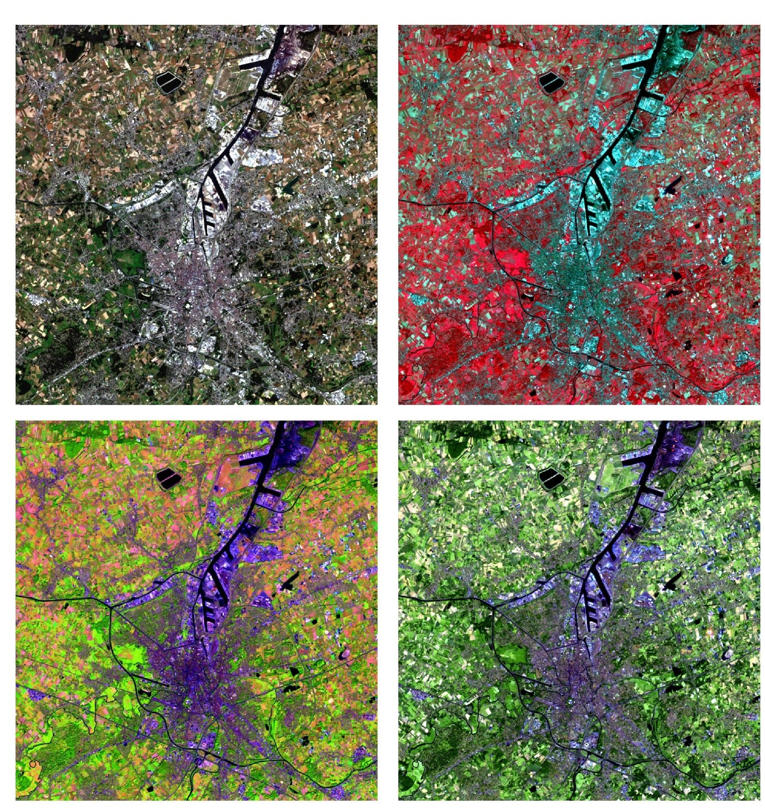

# Practicum 1: Image download & preprocessing

     
  <em> By combining different proportions of the three primary colours Red, Green and Blue, various colours are created </em>

 

## Doel van het practicum

In dit practicum zien we enkele tools voor het downloaden van losse Sentinel-2 beelden, het aanmaken en interpreteren van sentinel-2 beeldcomposieten in QGIS. Na deze 'introductie'-sessie wordt gebruik gemaakt van Google Earth Engine voor verdere beeldverwerkingoefeningen.

### Inhoud:

 * Downloaden van remote sensing data: 
     - via ESA sentinel hub
     - via andere bronnen
 * Introductie van QGIS:
     - Inlezen van RS beelden
     - Basisfunctionaliteiten QGIS
     - Aanmaken van beeldcomposieten
 * Beeldinterpretatie
     - Beeldcomposieten 
     - Histogrammen
 * Beeldvoorbewerking in QGIS (Sentinel-2):
     - Clipping
     - Resampling
     - Mosaicing