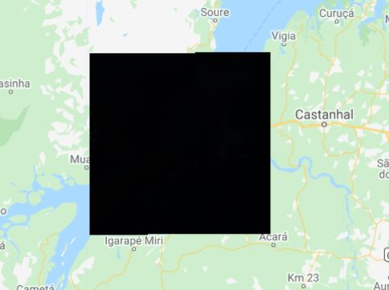
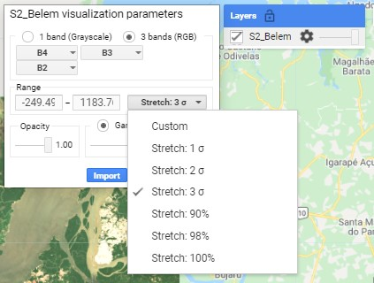
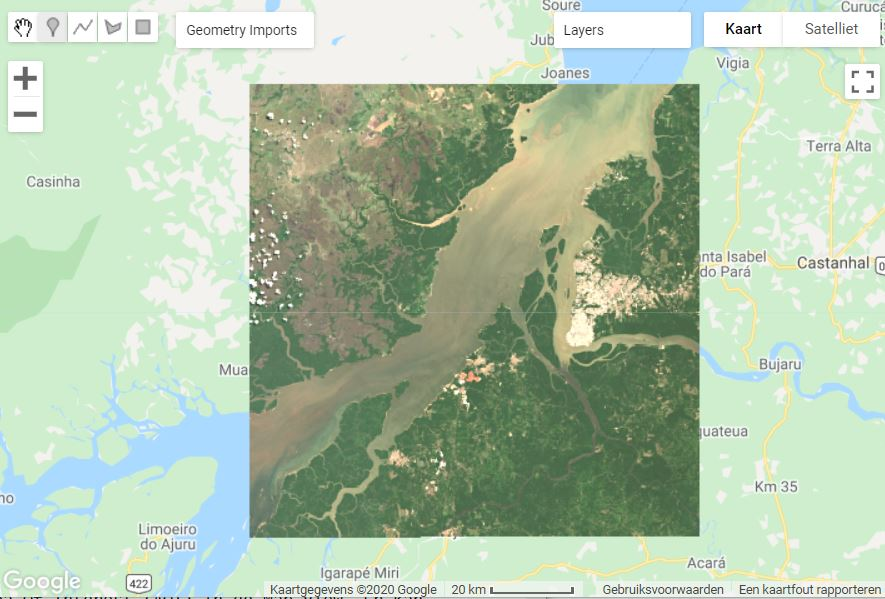
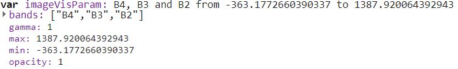
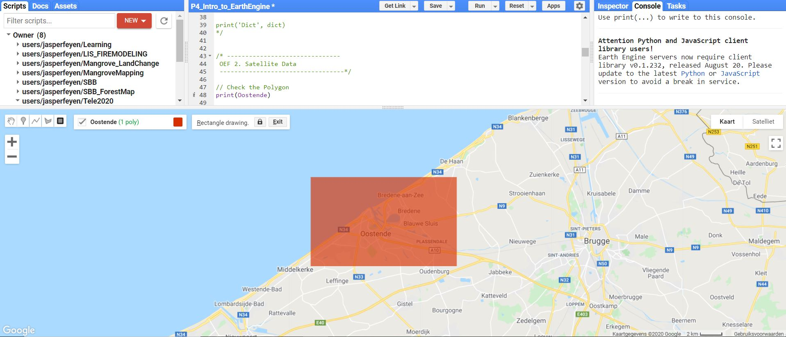
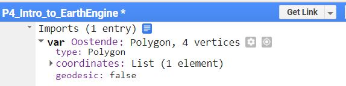
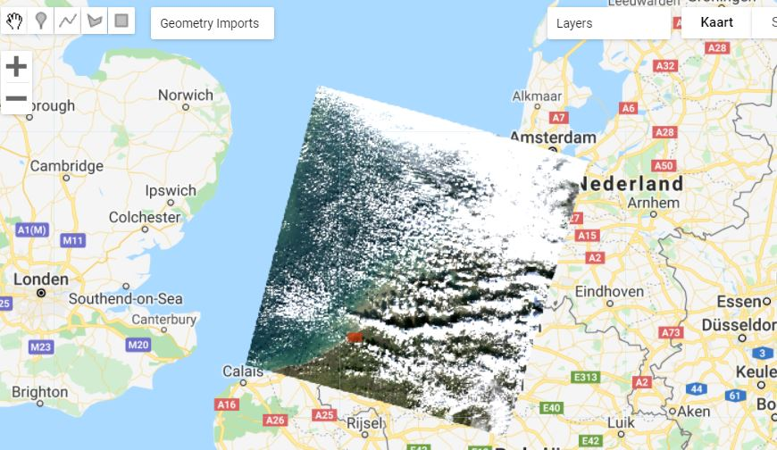
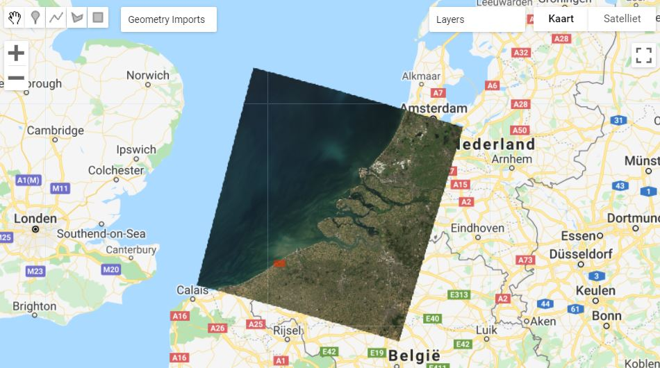
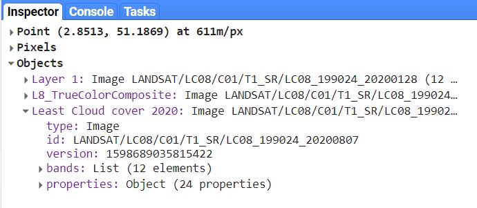

## Visualisatie van een enkelvoudig satellietbeeld 

Laten we simpel starten met het afbeelden van een enkel rasterbeeld. In Practicum 2 gingen we te werk met een Sentinel-2 beeld van de Braziliaanse stad Bélem uit 2021. Aangezien de volledige [Sentinel-bibliotheek](https://developers.google.com/earth-engine/datasets/catalog/sentinel) beschikbaar is binnen Earth Engine, kan dit beeld eenvoudig worden ingeladen. Bekijk hiervoor eerst de naam nog eens van je gedownload S2-bestand, bijvoorbeeld:

> S2B_MSIL1C_**20200808T134219_N0209_R124_T22MGD**_20200808T153444.SAFE

In Earth Engine is het vette gedeelte van de filenaam belangrijk. Dit wordt als volgt in earth-engine ingeladen, via **'ee.Image'**:

```javascript
//Voorbeeld: Sentinel-2 beeld van vorig practicum
var S2_Belem = ee.Image('COPERNICUS/S2_SR/20200808T134219_20200808T134214_T22MGD')
print(S2_Belem)

// Zoom in de Map-view in naar het beeld, met Zoom-factor 9
Map.centerObject(S2_Belem, 9);
```

Hiermee werd slechts een variabele aangemaakt die het beeld omvat. Om het beeld te visualiseren wordt gebruik gemaakt van de functie **Map.addLayer()**:

```javascript
//Visualiseren van het satellietbeeld
Map.addLayer(S2_Belem);
```
Bij het uitvoeren van bovenstaande code bekomen we een zwart vlak, niet bepaald de visualisatie die we wensen.

<p align="center">
    <br>
</p> 

Bij het uitvoeren van bovenstaande code bekomen we een zwart vlak, niet bepaald de visualisatie die we wensen. Dit komt omdat we nog geen visualisatieparameters hebben aangegeven, waardoor de eerste 3 banden naar de rode, groene en blauwe band respectievelijk worden toegekend en de pixelrange zo groot is dat alle pixels een zwarte kleur krijgen. Om dit manueel aan te passen, zoek je je toegevoegde laag in 'Layers' in de Map-view. Klik op het tandwieltje. Een visualisatie-scherm springt open. Pas de parameters aan, zodat je een normale kleurencomposiet verkrijgt, met een stretch van 3 sigma en druk op 'Apply'. Een visueel beter resultaat wordt verkregen.

!!! info "Image stretching"
    Verschillende stretch opties laten toe de histogrammen van het beeld te strechten om een betere visualisatie te krijgen. De stretch wordt uitgevoerd op basis van de huidige map view: ben je bijvoorbeeld ingezoomd om een stuk homogeen bos, wordt de stretch hierbinnen uitgevoerd. 
    <p align="center">
      <br>
    <em> Instellen van de visualisatieparameters kan via 'Layers' in de Map view. </em>
    </p> 
    

<p align="center">
    <br>
</p> 

Het is echter niet handig om steeds opnieuw de visualisatie handmatig in te stellen. Gelukkig kan deze ook als code geïmporteerd worden in GEE (klik op 'Import'). De visualisatieparameters worden toegevoegd in de Imports. Deze kunnen dan in de Map.addLayer() -functie worden meegeven tijdens het visualiseren.

<p align="center">
    <br>
</p> 

In de code-editor zelf kunnen de visualisatieparameters eveneens gedefinieerd worden als een Object.
```javascript
// Aanmaken van visualizatieparameters
var visualization = {
  min: 0,
  max: 3000,
  bands: ['B4', 'B3', 'B2'],
};
Map.centerObject(S2_Belem, 9);
Map.addLayer(S2_Belem, visualization,'Bèlem_met_Vis');
```

## Beeldcollecties zoeken en filteren

In voorgaande paragraaf visualiseerden we een Sentinel-2 beeld die we reeds hadden opgezocht waarvan wisten dat de kwaliteit goed zat én waarvan we de bestandsnaam reeds kenden. Het is natuurlijk niet handig om steeds een filenaam te moeten kennen om verder te kunnen werken in Earth Engine. Daarmee zouden we ook de geweldige kracht van het programma om doorheen vele petabytes aan aardobservatiedata te zoeken onbenut laten.  

In wat volgt gaan we op basis van een locatie op zoek gaan naar geschikte satellietbeelden, door het filteren van gehele beeldcollecties.

### Region of Interest (ROI)

Starten doen we met het intekenen van een gewenste **Region Of Interest** (ROI) in de Map View. Een ROI is niets anders dan de afbakening van het studiegebied, waarbinnen we onze data wensen te verkrijgen.  

Er kan rechtstreeks gezoomd worden naar een locatie via de zoekbalk bovenaan of door het scrollen met de muis. Teken vervolgs een gewenste gebied in door gebruik te maken van de toolknoppen in de "Map View": {: style="height:25px"}.  

In dit voorbeeld kiezen we voor de Konigin der badsteden, Oostende, als studiegebied:

<p align="center">
    <br>
</p> 

Automatisch wordt een nieuwe variabele aangemaakt onder de naam 'geometry', welke eenvoudig hernoemd kan worden naar een eenvoudig te gebruiken variabelenaam: 

<p align="center">
    <br>
</p> 

Bekijk de eigenschappen van de polygoon door het naar de console te printen:

```javascript
//Polygoon-informatie naar de console schrijven:

print(Oostende)
```


### Inlezen en filteren van een ``` ImageCollection```

Voor deze oefening maken we als afwisseling gebruik van Landsat 9 beelden (zie ook het stukje omtrent de [Earth Engine data catalog]()). De code om de Landsat 9 collectie te importeren kan gekopieerd worden uit de data catalog en ziet er als volgt uit:

```javascript
var L9 = ee.ImageCollection("LANDSAT/LC09/C02/T1_L2")
print('Grootte van de L9-collectie :', L9.size())
```

Hiermee verwijst de variabele 'L9' naar de volledige Landsat-9 collectie (surface reflectance). De '.size()'-functie berekent het aantal beelden dat in deze collectie zijn begrepen. Een hele hoop, sinds de collectie alle L9-beelden van de volledige aarde omvat. Om hier verder mee te werken dient de verzameling bijgevolg gefilterd te worden tot ons interessegebied en tijdstip. Filteren kan op basis van de metadata:

```javascript
//Filteren o.b.v. datum, locatie:
var L8 = L8.filterDate('2022-01-01', '2022-10-15') //Op basis van datum
           .filterBounds(Oostende) //op basis van locatie (de AOI);

//Printen van de nieuwe grootte
print('L9 size na filtering',L9.size())

// Printen van de collectie voor inspectie
print('Filtered collection: ', L9)
```

De Landsat Surface Reflectance dataset van Landsat 8 is al atmosferisch gecorrigeerd, maar nog niet geschaald naar een 0-1 range (reden: efficiëntere data-opslag). Op dit te doen, moet eerst een 'herschalingsfunctie' worden gedefinieerd en toegepast.

```javascript
// Toepassen schalingswaarden.
function applyScaleFactors(image) {
  var opticalBands = image.select('SR_B.').multiply(0.0000275).add(-0.2);
  var thermalBands = image.select('ST_B.*').multiply(0.00341802).add(149.0);
  return image.addBands(opticalBands, null, true)
              .addBands(thermalBands, null, true);
}

var L9 = L9.map(applyScaleFactors)
```

De beelden in de collectie zijn standaard gesorteerd op datum. Indien we dus het eerste beeld uit de collectie  halen, zal dit het eerste Landsat-9 beeld zijn gemaakt in 2022 van Oostende. Met de functie *.first()* halen we deze eruit.  Print deze naar de console en bekijk het verschil met de de Imagecollectie.

```javascript
// Krijg het eerste (standaard oudste) beeld uit de collectie:
var L9_first = L9.first()
print('Eerste Beeld:', L9_first)

```


The Landsat Surface Reflectance dataset of Landsat 9 in Google Earth engine is already atmospherically corrected, so we don't need to further preprocess this image. However, the the image still need to be scaled to a 0-1 Surface Reflectance value (due to storage the data is stored as Signed 16-bit integer).


```javascript Map.addLayer() ```. Ook nu kunnen we dit als een echte kleurencomposiet visualiseren (voor Landsat 9 betekent dit dus B2 (blauw), B3 (groen) en B4 (rood)). De bandnamen voor Landsat 9 Surface Reflectance (SR) beelden in google earth engine worden genoemd als SR_B*. 


```javascript
// Landsat 9 visualisatie instellen.
var trueColor = {
  bands: ['SR_B4', 'SR_B3', 'SR_B2'],
  min: 0,
  max: 0.3,
  gamma: 1.4,
};
Map.addLayer(L9_first, trueColor, 'L9_TrueColorComposite')
```

<p align="center">
    <br>
  <em> Eerste Landsat 9 beeld binnen de gefilterede collectie </em>
</p> 

Mogelijk is dit eerste beeld niet het meest ideale wat betreft de wolkbedekking, waardoor er weinig te zien valt. Laten we nu op zoek gaan naar het beeld met de laagste wolkenbedekking binnen de collectie. Dit doen we in eerste instantie door de collectie te sorteren volgens het percentage cloudcover, wat standaard tot de metadata van een Landsatbeeld behoort.
Bekijk het beeld. Wat valt je op? Wordt het volledige gebied bedekt?

```javascript
//Sorteren van de collectie obv cloud cover
var L9_sortedCC = L9sort('CLOUD_COVER',true);
Map.addLayer(L9_sortedCC.first(), trueColor, 'Least Cloud cover 2022')

```

<p align="center">
    <br>
  <em> Landsat 9 satellietbeeld met laagste wolkbedekking binnen de gefilterede collectie </em>
</p>  

Bekijk op welke dag de sensor dit beeld heeft genomen. Gebruik hiervoor de ‘inspector’ om de beeldeigenschappen verder te bekijken.

<p align="center">
    <br>
  <em> De inspector </em>
</p>  


    

### Opdracht 3.1 - Valse kleurencomposiet voor Gent
Visualiseer in een nieuw script een valse kleurencomposiet van een Sentinel-2 beeld (Tier 1, Harmonized Level-2A, Surface Reflectance). Neem hierbij Gent als ROI, met een beeld uit 2021 met de laagste wolkbedekking.  
    
Voor het sorteren van de wolkenbedekking, zoek je de gepaste eigenschap om op te sorteren. Deze kun je [hier](https://developers.google.com/earth-engine/datasets/catalog/COPERNICUS_S2_SR#image-properties){target=_blank} vinden.

Bewaar je script.

??? check "Oplossing"
    GEE script: [https://code.earthengine.google.com/d596e4b5b6017e1dedf440f43fc48201](https://code.earthengine.google.com/d596e4b5b6017e1dedf440f43fc48201){target=_blank}


