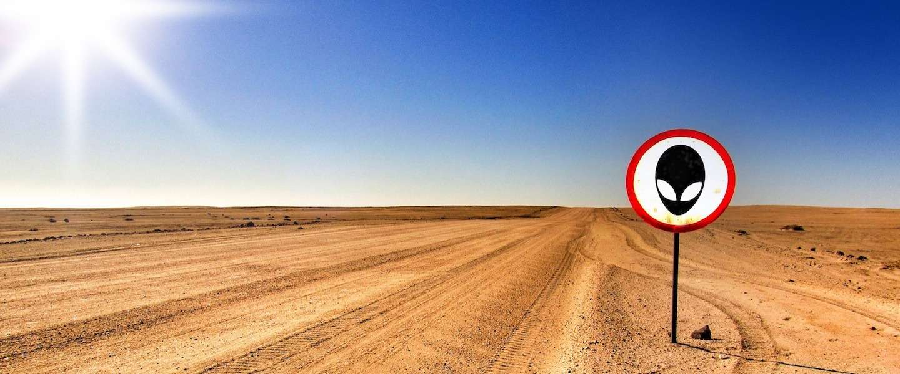

Onderstaande oefeningen kunnen gebruikt worden om P4 verder in te oefenen.

## Oefening .1 - Area 51

<p align="center">
    <br>
</p> 


**Niveau**: gemakkelijk

Stappen: 

1.  Open een nieuw script

3.  Laad een Landsat 8 collectie in. Ga voor de beelden met de hoogste kwaliteit. Welke collectie kies je dan?

4.  Filter je collectie op basis van volgende gevens:  

    - **Periode**: september 2021

    - **Locatie**: Area 51. Hiervoor kun je volgende punt-locatie in je script gebruiken: 
```javascript
var Area51 = ee.Geometry.Point([-115.81441562461978, 37.2386297535804]);
```
    - **Wolkbedekking**: minder of gelijk aan 10%

5. Hoeveel beelden blijven er nog over die aan bovenstaande criteria voldoen?

6. Van de resterende beeldencollectie neem je het eerste beeld (niet gesorteerd). Bekijk de metadata. Van welke datum is dit beeld afkomstig?

7. Visualiseer het beeld als een Normale Kleuren composiet, een Valse Kleurencomposiet. Je kunt zelf je visualisatieparameters defeniëren door ze handmatig aan in te stellen.

8. Analyseer het volledige door jezelf volgende vragen te stellen:

    - Waar is er vegetatie te vinden? Waar is dit natuurlijk, waar onnatuurlijk?

    - Welke features herken je thv Area 51?

9. Het gebied geeft ook een ideale aanleiding om de 'Geology'-composiet eens uit te testen. De combinaties is als volgt: **RGB =  SWIR2-NIR-BLUE** . Ga na welke Landsat-8 banden hiervoor benodigd zijn. (Maak gebruik van de [Landsat 8 bandentabel](https://landsat.gsfc.nasa.gov/sites/landsat/files/2013/01/BandpassesL7vL8_Jul20131.jpg)). Deze composiet maakt visuele inspectie van grote structurele eigenschappen van gesteenten (zoals plooien en breuken) gemakkelijker.

??? check "Oplossing"
    Script: [https://code.earthengine.google.com/210e520368aa1cc39ca8e18a51cb71e0](https://code.earthengine.google.com/210e520368aa1cc39ca8e18a51cb71e0)


## Oefening 4.2

Fires are raging in Bolivia, hitting particularly hard the Chiquitano dry forests of the country’s southern Santa Cruz region. The fires are largely the result of intentional burning to convert forest to farmland. Sources say this practice has recently intensified after Bolivian president Evo Morales signed a decree in July expanding land demarcated for livestock production and the agribusiness sector to include Permanent Forest Production Lands in the regions of Beni and Santa Cruz.  Satellite data indicate 2019 may be a banner year for forest loss, with tree cover loss alerts spiking in late August to levels more than double the average of previous years. Human communities are suffering due to the fires, with reports of smoke-caused illnesses and drinking water shortages. Meanwhile, biologists are worried about the plants and animals of the Chiquitano dry forests, many of which are unique, isolated and found nowhere else in the world.

**GEGEVEN**: 
Startscript met aanduiding van het studiegebied (ROI)  [https://code.earthengine.google.com/2eba6fb83f6efb634a8286b52fd89bbc](https://code.earthengine.google.com/2eba6fb83f6efb634a8286b52fd89bbc)

**GEVRAAGD**:
Maak een 2 Sentinel-2 beelden aan, met volgende specificaties:  
  - Gebruik van de Sentinel-2 Top-Of-Atmosphere (TOA) collectie.  
  - Gefilterd op het studiegebied (ROI)  
  - Gefilterd op maximale wolkbedekking van 30%  
  - Wolken dienen worden te verwijderd uit de beelden.  
  - Gefilterd op de periodes:  

       - Beeld 1: het jaar 2017 (1 juni t.e.m 30 oktober)
       - Beeld 2: het jaar 2019 (1 juni t.e.m 30 oktober))

- Voor elke pixel de mediane waarde van beide overgebleven collecties

**SUBVRAAG 1.1**  - Hoeveel beelden resteren er nog in beide collecties na filtering?
**SUBVRAAG 1.2**  - Visualiseer een Normale Kleurencomposiet voor beide jaren.

=======

## Oefening 4.2
*Coming Soon*
