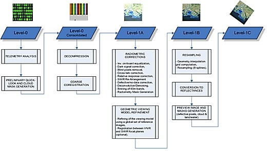
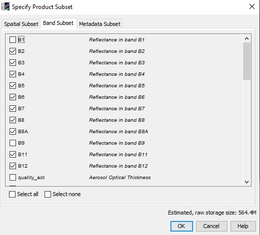

## Radiometric & atmospheric correction

Satellite images obtained by the sensing device are not directly usable. They need to go through a series of pre-processing before they are ready to use. The scheme below illustrates the pre-processing steps that Sentinel-images undergo before they are made available for the user. This includes **geometric** correction, some **radiometric correction** (noise reduction, defective pixels identification) the computation of cloud masks, etc. The outcome is a level 1C product, which is Top-Of-the-Atmosphere (TOA). 

TOA reflectances are subjected to radiometric bias caused by different lighting conditions, atmospheric interactions and viewing geometry. In order to relate reflectances to physical field properties, TOA reflectance values are conversed to BOA (Bottom Of Atmosphere) corrected reflectance values. This radiometric correction is an essential part in image processing. BOA, Sentinel processing level 2A, is available for the user (except for recent images) or can be created by the user itself, using the Sen2Cor freeware.  

   
<em>Figure: A true color comparison of the surface reflectance product (top) and a top of atmosphere reflectance image (bottom) in adjacent scenes captured by the same satellite (Planet.com)</em> 

 

In Snap, the conversion of level 1C TOA-reflectance to level 2A BOA-reflectance can be done through Sen2Cor (plug-in or stand-alone).  Sen2Cor corrects the reflectance values based on (among others) ‘look-up tables’, these are tables that relate physical parameters to model coefficients. Parameters such as inclination and product type are sensor dependent (different for Landsat as for Sentinel or Spot). On board, optical satellites have some meteorological sensors that measure atmosphere features such as the air thickness and the amount of aerosols among others. This information is available as a ‘header file’ for each image.   

Since December 2018, users can download Level-2A processed products directly. In case of this exercise, we downloaded a Level 1C product. Thus, let’s perform an atmospheric correction!

!!! note "Excercise: atmospheric correction with Sen2Cor"
    * In the folder where you have saved the image, unzip the Sentinel-image.  
    * Go to *‘Optical’ > ‘Thematic Land Processing’ > ‘Sen2Cor processor’ > ‘Sen2Cor280’*  
    * When you choose the source product, click on the ‘…’, browse to the image and navigate to the ‘MTD_MSIL1C.xml’ product.
    * In the tab ‘processing parameters’, set the resolution to ‘ALL’
    * The other processing parameters are by default taken from a combination of the image metadata (header file) and look-up tables. This is why you will normally use the default processing parameters. However, if you want to adjust these parameters, you can do that manually. 
    * Run Sen2Cor (!be patient, it will take a while to process the entire image.)
    * Explore the outcome image (RGB). What differences do you see according to the original image? 

!!! warning "Installing 'Sen2Cor' plugin"
    Possibly sen2cor isn’t installed yet. To do this, go to ‘Tools’ > ‘Plugins’. During the first run, you’ll get an error, after which an extra bundle will be installed. ).

## Intermezzo: Cloud Masks
The image contain clouds. This means that there are some blind pixels, which lack information on the reflectance of the earth’s surface at the sensing time. This phenomenon is very common in tropical areas with a rainy season. It is possible that over the whole period of the rainy season, you will not be able to obtain images with a cloud cover of less than 90%. In such cases, Radar imaging can be useful, but are complexer. An introduction to radar imaging will be given later in these practicals.

   

 
 

Included in a Sentinel-2 image folder you can find some cloud masks at a resolution of 10m, 20m and 60m. These cloud masks enable the user to identify cloudy and cloud-free pixels. The masks include both dense clouds (opaque clouds) and cirrus clouds. These cloud masks are computed by a threshold algorithm. Below, the methods are described that identify the cloud pixels (for your information).

**Identification of dense clouds** 
 
Dense clouds, also called opaque clouds, are characterised by a high reflectance in the blue spectral region (B2). The method used to identify dense cloud pixels is based on B2 reflectance threshold. To avoid false detection, mainly due to snow/cloud confusion, SWIR reflectance in B11 and B12 are also used. Snow and clouds both have a high reflectance in the blue. Cloud reflectance is high in the SWIR, whereas snow presents a low reflectance. Additional criteria based on B10 reflectance are added to avoid high altitude ice cloud and snow confusion (both having a low reflectance in the SWIR bands B11 and B12). At B10, there is a high atmospheric absorption band and only high altitude clouds are detected. However, this last criterion is only applied after a first detection of cloud pixel in the blue band where cirrus is transparent.  

**Identification of cirrus clouds**  

Cirrus clouds are thin, transparent or semi-transparent clouds, forming at high altitudes, approximately 6-7 km above the Earth's surface. The method of identifying cirrus cloud pixels from dense cloud pixel is based on two spectral criteria: (1) B10 corresponds to a high atmospheric absorption band: only high altitude clouds can be detected, (2) cirrus clouds, being semi-transparent, cannot be detected in the B2 blue band. A pixel with low reflectance in the B2 band and high reflectance in the B10 band has a good probability of being cirrus cloud but this is not a certainty. Some opaque clouds have a low reflectance in the blue and can be identified as cirrus cloud. To limit false detections (due to high reflectance in the blue or due to the fact that clouds are not spectrally registered), a filter using morphology-based operations is applied on both dense and cirrus cloud masks: (1) erosion, to remove isolated pixels, (2) dilatation, to fill the gap and extend clouds. If after morphology operations, a pixel is both dense and cirrus, the dense cloud mask prevails. 

**Sen2Cor scene classification**  

The Sen2Cor-processor you've runned for the atmospheric correction from the level 1C to the level 2A product also contains a scene classification algorithm. This algorithm creates a scene classification, where pixels als classified in some broad classes:

Here, clouds are classified into 'cloud probability masks', which are in general more precise than the level 1C cloud masks.
 

   

 

!!! note "Excercise: Visualize cloud masks"
    - Visualize the cloud masks.
    - If you look at the cloud masks, you will see that these are not very precise. These cloud masks are useful for rough estimations. Later we will see alternative ways to identify cloud pixels more precise. 

## Resampling
In order to display the other band combinations, some geometrical pre-processing is necessary. The bands have to be resampled to an equal resolution. The goal is to resample the image bands to 10m (you can take B2, B3, B4 or B8 as a reference band). This means that all other bands will be upsampled.

   
  
  <em>Image resampling scheme. Top: upsampling (nearest neighbor). Bottom: Downsampling (minimum). </em> 

 

!!! note "Exercise: resampling"
    - In the product explorer, select the outcome image of Sen2Cor. Go to *Raster > Geometric operations > Resampling*. 
    - Select the ‘Save as… BEAM-DIMAP’ box. Browse to your directory. Choose a logical name for the target product.
    - Resampling Parameters: Choose a reference band that has a resolution of 10m, or choose for a pixel resolution of 10m. Use an upsampling method of your choice (Read the help for more details on the different algorithms).
    - Run *resampling*. 
    - Saving the images takes a lot of time. Again, be patient! 

## Image Subsetting
Processing an entire Sentinel image takes a lot of processing capacity and time (as you probably have noted already). Therefore, you will now learn how to only process a small part of the image. You can choose to reduce the spatial extent of the image, or you can choose to reduce the amount of bands in the image, or a combination of both.

An important aspect is that creating a subset is only possible for bands that have the same size. Thus, this will only be possible **after resampling**.  

!!! note "Excercise: subsetting an image"
    - Select the resampled image in the product explorer. Go to Raster > Subset.
    - Select a spatial subset by choice (by adjusting the scene start and end). Make sure your spatial extent is substantially smaller than the original image.
    

     
    <em>Snap Subsetting screen.</em> 
    - Select only following bands: [B2, B3, B4, B5, B6, B7, B8, B8A, B11, B12]
    - You can see an estimation of the new required storage space.
    

     
    <em>Snap Subsetting screen.</em> 
    - Click OK
    - Another option to make a subset is ‘Spatial subset from view’. Zoom in on your image. Rightclick and select ‘Spatial subset from view’. 
    - FYI: it is also possible to take a subset of an image, based on a vector layer. 

## Mosaicing
Mosaicing is the merging of several arbitrarily shaped images and often used to merge two neighbouring satellite images.  

!!! note "Excercise: mosaicing"
    - Download an image that is located next to the image you are already working with, dating from the same time as the original image was taken. 
    - You can download it directly in Level 2A, thus skipping the sen2cor atmospheric correction.
    - Resample the image. 
    - Go to raster > Geometric operations > Mosaicing 
    

     
    <em>Snap mosaicing screen.</em>  
    - Add the two source products.
    - Choose the directory in which you want to save the mosaic image.
    - In the Map Projection Definition you can choose the Coordinate Reference System (CRS). Choose for UTM/WGS84 (automatic)
    - Choose for a resolution of 10m.
    - The input products don’t need to be orthorectified (because they already are).
    - In the tab ‘Variables and Conditions’, click the  - symbol.
    - Select Band 2,3,4 and 8
    - Run Mosaicing.
    - Open the RGB-image of the product. Compare it to the two original images. 

!!! Question "Extra: Examine the example of Landsat satellite image after merging below." 
    1. What went wrong when mosaicing images 1 and 2?
    2. Why is there a colour difference in 2 and 3?
    3. Why is there no observable colour difference in 2 and 4?
    4. Have you any idea how to eliminate the colour difference between 2 and 3, given that neighbouring satellite images always partly overlap?
    

     
    <em>Landsat images mosaic</em>  
