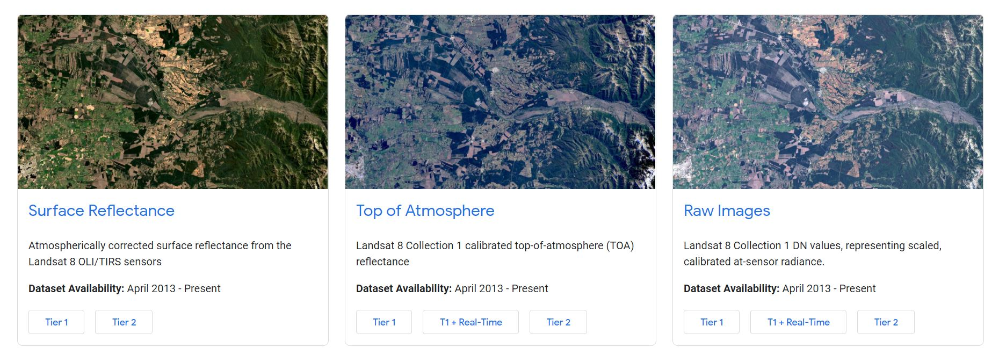
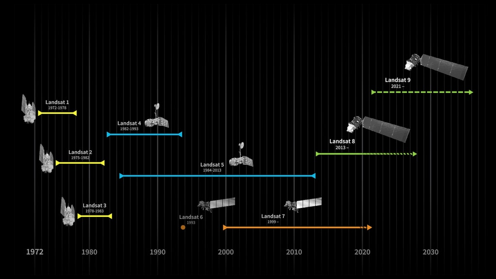
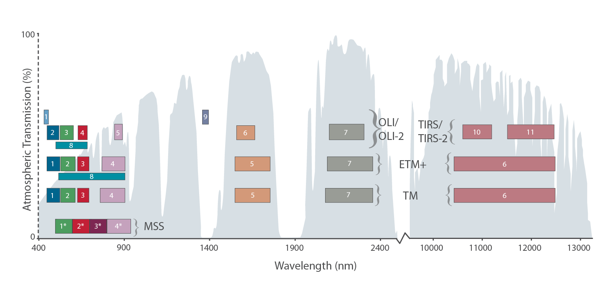

## De Earth Engine Data Catalog

Om het aanbod aan aardobservatie-data in Google Earth Engine te bekijken en te doorzoeken, kan gebruik gemaakt worden van de Earth Engine Data Catalog: <a href="https://developers.google.com/earth-engine/datasets" target="_blank">https://developers.google.com/earth-engine/datasets</a>. Via deze catalogus kun je eenvoudig rasterdata allerhande opzoeken: satellietdata, weerdata, terreindata, populatiedata,... Via de catalogus vindt je ook de noodzakelijke code om de beeldensets in je script te importeren vinden.

In de komende voorbeeldoefening maken we gebruik van Landsat data. In Earth Engine zijn Landsatbeelden in eerste instantie opgedeeld op basis van Collecties:

  - **Collection 2**: omvat de volledige Landsat collectie volgens de recent (April 2021) geoptimaliseerde preprocessing-keten en opslagstructuur van de USGS. Je kiest dus voor nieuwe scripts/oefeningen voor deze collectie.

  - **Collection 1**: omvat de collectie van Landsatbeelden volgens de oude procedures. Deze collectie is nog steeds beschikbaar als overgingmaatregeling, maar wordt vanaf 1 januari 2022 volledig vervangen.

Een tweede opdeling van de landsatcollectie gebeurd op basis van de de uitgevoerde correcties. Elk beeld is dus beschikbaar in 3 vormen:  

  - **'Surface reflectance'**: atmosferisch gecorrigeerde beelden: 'Bottom of Atmosphere'.
  - **'Top-Of-Atmosphere'**: niet atmosferisch gecorrigeerd, wel radiometrisch gecalibreerd.
  - **'Raw Images'**: niet radiometrisch gecalibreerd.

     

 

Een derde opdeling gebeurt ten slotte op basis van de beeldkwaliteit:  

   - **Tier 1**: De meest kwalitatieve beelden, geschikt voor tijdserie-analyse. De beelden zijn zowel geometrisch als radiometrisch kwalitatief goed bevonden volgens opgestelde standaarden.  
   - **Tier 2**: De beelden zijn geometrisch en/of radiometrisch minder kwalitatief bevonden, maar zijn wel nog inzetbaar voor bepaalde doeleinden.  
   - **Tier 1 + Real-Time**: De Tier-1 database uitgebreid met de meest recente data die nog niet kwalitatief gekeurd zijn en bijgevolg dus nog "fouten" kunnen bevatten. (Enkel als TOA beschikbaar)

!!! info "Het Landsat programma"
    Landsat is het langst lopende aardobservatie satellietprogramma en is sinds 1972 continue operationeel. Het is een samenwerking tussen de *United States Geological Survey* (USGS) en de NASA. Op 27 september 2021 werd de Landsat 9 gelanceerd en is daarmee de meest recente Landsat-satelliet.

    

       
    
 
    
    Onderstaande grafiek geeft een overzicht van de bandverdeling van de Landsatsatellieten. Huidig actieve Landsat-satellieten zijn Landsat 9 (OLI-2/TIRS-2) 8 (OLI/TIRS) en Landsat 7 (ETM+) (Bron: [NASA](https://landsat.gsfc.nasa.gov/landsat-9/landsat-9-spectral-bands))

    

       
    
 

