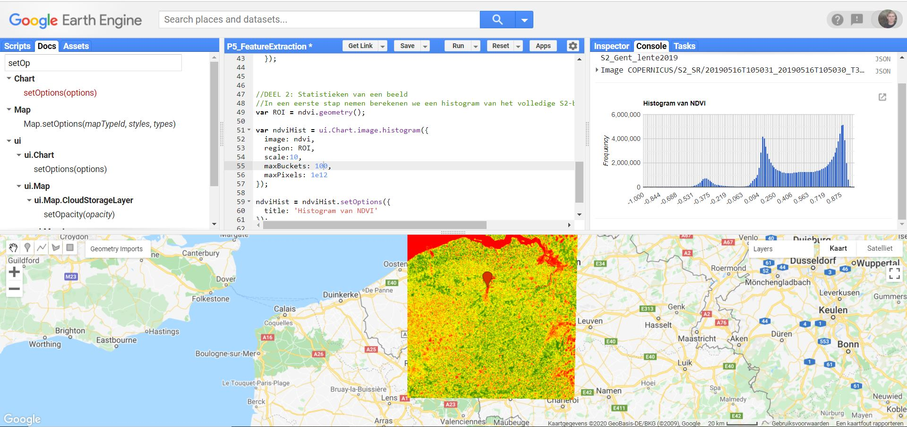

## Histogram

Een histogram is, binnen de remote sensing, een grafische weerave van de statistische frequentie van de pixelwaarden binnen een satellietbeeld. Deze pixelwaarden verspreiden zich tussen de waarden 0 en 255. In een histogram worden deze waarden op de *x*-as geplot, terwijl de overeenkomstige frequentie voor elke waarde binnen het beeld op de Y-as wordt geplot.

In wat volgt maken we een histogram aan van het aangemaakte ndvi-beeld. Hiervoor is steeds een regio (dus polygoon) noodzakelijk, waarvoor een histogram wordt aangemaakt. In een eerste fase doen we dit voor het volledige weerhouden satellietbeeld. Op de geometrie van dit beeld naar earth engine te vertalen naar een polygoon maken we gebruik van de functie ```.geometry()```.

```javascript
var ROI = ndvi.geometry();
```

Bekijk de resulterende ROI eventueel door deze te mappen met ```Map.addLayer(ROI)```. Uiteraard kun je ook handmatig een polygoon intekenen.

Om een histogram aan te maken wordt gebruik gemaakt van de ```ui.Chart.image.histogram()```-functie binnen Earth Engine. Deze functie neemt volgende elementen aan (ook te checken via de 'Docs'): het beeld, de ROI, de schaal waarover de histogram wordt berekend, het aantal te plotten histogrambalkjes. Layout-opties worden afzonderlijk toegekend via ```.setOptions()```.


```javascript
//Initialiseren van een historgram via de ui.Chart functie
var ndviHist = ui.Chart.image.histogram({
  image: ndvi,
  region: ROI,
  scale:10,
  maxBuckets: 50,
  maxPixels: 1e12
});

//Histogram updaten met stijlopties
ndviHist = ndviHist.setOptions({
  title: 'Histogram van NDVI in de Gentse Haven'
});

//Histogram schrijven naar de console
print(ndviHist)
```

<p align="center">
  <br>
</p> 


??? info "Parameters meegeven aan een functie"
    Als je parameters meegeeft aan een functie in Javascript, kun je dit op 2 manieren doen:  
        
       1. De (noodzakelijke) parameters meegeven in volgorde aan de functie. Bijvoorbeeld: ```ui.Chart.image.histogram(ndvi, ROI, 10, 50)```. Hierbij is het noodzakelijk dat de paramters in juist volgorde worden meegeven en er geen parameters worden overgeslagen.  
       2. Opstellen van een ```dictionary```, waarbij de parameters expliciet worden toegekend, zoals in het voorbeeld hierboven. Dit zorgt voor wat extra overzicht.
       ```javascript
       var ndviHist = ui.Chart.image.histogram({
       image: ndvi,
       region: ROI,
       scale: 10,
       maxBuckets: 50,
       maxPixels: 1e12
       });
       ```

???+ note "NDVI Histogram van Haven Gent/Vlaanderen"
     Als je kijkt naar het resulterend histogram, dan kun je enkele pieken opmerken: rond -0.3, rond 0.1 en rond 0.8. Verklaar de oorsprong van deze pieken.

## Bandstatistieken

Om beeldstatistieken binnen een bepaalde ROI te berekenen binnen Earth Engine wordt gebruik gemaakt van ```image.reduceRegion()```, of binnen meerdere regio's ```image.reduceRegions()```. Het principe van deze 'beeldreducer' is hetzelfde als een recuder van een  ```ImageCollection```, met dat verschil dat de pixels binnen een regio van eenzelfde beeld worden gereduceerd, zoals in onderstaande figuur wordt geïllustreerd. Hiermee kan m.a.w. - binnen een bepaalde ROI - bepaalde statistieken berekend worden, zoals het minimum, gemiddelde pixelwaarde, maximum, mediane waarde, ...

### Voorbeeld 1 - ReduceRegion

<p align="center">
  <br>
<em> Illustratie van een Reducer toegepast op een beeld (Image) binnen een bepaalde regio. </em>
</p> 

```javascript
//Statistieken van NDVI: Toepassen van een Reducer
var ndvi_mean = ndvi.reduceRegion({
  reducer: ee.Reducer.mean(),
  geometry: ROI,
  scale: 10,
  maxPixels: 1e12
});

print('Gemiddelde NDVI-waarde', ndvi_mean)
```

### Voorbeeld 2 - ReduceRegions

In dit voorbeeld werken we met de [WorldClim-data](https://developers.google.com/earth-engine/datasets/catalog/WORLDCLIM_V1_MONTHLY#image-properties). We berekenen per provincie de totale maandelijkse gemiddelde neerslag. In welke provinice valt er het meeste regen in de maand Januari?

  - Start met het visualizeren van het beeld.
  - Filter het beeld op basis van de Maand-eigenschap tot de maand Januari
  - Gebruik de 	ReduceRegions-functie, gelijkaardig aan de reduceRegion(), maar ditmaal geef je aan volgens welke collectie (= featurecollectie) je de reductie wilt uitvoeren. Geef daarnaast ook de te gebruiken reducer aan (Sum)
 
??? check "Oplossingen"
    ```javascript
    var dataset = ee.ImageCollection('WORLDCLIM/V1/MONTHLY');
    var meanPrec = dataset.select('prec');
    var meanPrecVis = {
      min: 0.0,
      max: 100.0,
      palette: ['blue', 'purple', 'cyan', 'green', 'yellow', 'red'],
    };


    var meanPrecJan = meanPrec.filter(ee.Filter.eq('month',1)).first()
    print(meanPrec)
    // Clippen op basis van de provincies
    var provinces = ee.FeatureCollection('projects/ee-teledetectie-2021/assets/P5-    FeatureExtraction/Belgium_provinces')
    var prec_Belgium = meanPrecJan.clip(provinces)
    Map.addLayer(prec_Belgium , meanPrecVis, 'Mean Precipitation');

    //Map.addLayer(provincies)
    Map.centerObject(provinces)

    //REDUCE REGIONS
    var reduced = prec_Belgium.reduceRegions({
      'collection': provinces,
      'reducer':ee.Reducer.sum(),
      //'scale':927,
    })

    print(reduced)
    ```


