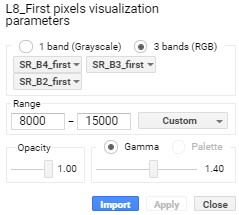
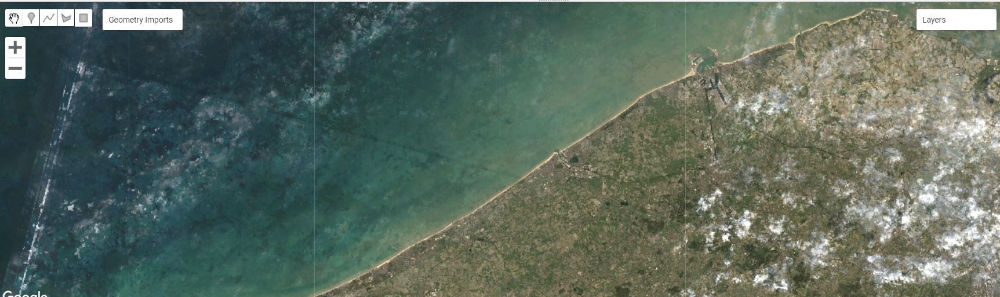

## Over Reducing
‘Reducing’ een beeld- of datacollectie in Google Earth Engine is het proces waarbij de beeldcollectie wordt geaggregeerd over tijd, ruimte, banden, ....  

In dit proces wordt een beeldcomposiet aangemaakt van de beschikbare beelden in de collectie, waarbij per pixel een bepaalde vooropgestelde waarde wordt gekozen, zoals het min, max, gemiddelde, mediaan,… De collectie wordt als het ware 'gereduceerd' tot één enkel visualiseerbaar beeld.

<p align="center">
    <br>
  <em> Reducing an ImageCollection: principe. </em>
</p>  

Een voorbeeld: neem de eerste pixel van de gefilterde en gesorteerde Landsat 8 collectie ```L8_sortedCC ```. Visualiseer het resultaat. Wat valt je op? Is ditmaal het volledige gebied bedekt?

```javascript
//  Reducer over de L8_sortedCC collectie, waarbij steeds de eerste pixel genomen wordt.
var L8_first_red = L8_sortedCC.reduce(ee.Reducer.first());

//Bekijk de eigenschappen van het gereduceerd beeld
print(L8_first_red)

var visParams_first = {
  bands: ['SR_B4_first', 'SR_B3_first', 'SR_B2_first'],
  min: 8000,
  max: 15000,
  gamma: 1.4,
};

// Visualiseren als een normale kleurencomposiet
Map.addLayer(L8_first_red, visParams_first, 'L8_First pixels')

```

!!! warning "Bandbenaming na reducing"
    Let ook, bij het aanroepen van ```ee.reducer```, worden ook de banden hernoemd. Houd hier rekening mee bij het visualiseren. Het eventueel hernoemen van banden kan via de functie **```.rename()```**
    <p align="center">
      <br>
    <em> Bandnamen bij de 'First'-gereduceerde collectie. </em>
    </p>

!!! warning "```ee.Reducer.first()``` VS ```.first()```"
    In een eerdere oefening namen we reeds het eerste beeld uit een hele collectie met de ```.first()``` functie. Dit is dus niet hetzelfde, gezien een reducer zicht niet beperkt tot één enkel beeld, maar de volledige collectie gaat reduceren. 

## Shortcut syntax

Bepaalde – veel gebruikte – reducers hebben ook een zogenaamde ‘shortcut’ syntax in Earth engine: ```mean()```, ```median()```, ```min()``` en ```sum()``` kunnen rechtstreeks gebruikt worden. Deze shortcut syntax zorgt ervoor dat een collectie eenvoudiger te reduceren is, zonder de hele ```.reduce((ee.Reducer.mean())``` syntax te moeten gebruiken. Een voorbeeld:

```javascript

//Een Median() Reducer over the Landsat-8 collectie
var L8_median = L8.reduce(ee.Reducer.median());

//Of via de short-syntax (geeft zelfde resultaat)
var L8_median = L8.median();

// Visualiseren
Map.addLayer(L8_median, trueColor, 'L8_median')

```

<p align="center">
    <br>
  <em> Voorbeeld mediane reducer over de L8_sortedCC-collectie </em>
</p>  

### Opdracht 3.2
Probeer enkele van de Reducers uit op je Sentinel-2 collectie van Gent.
Bewaar je script.
