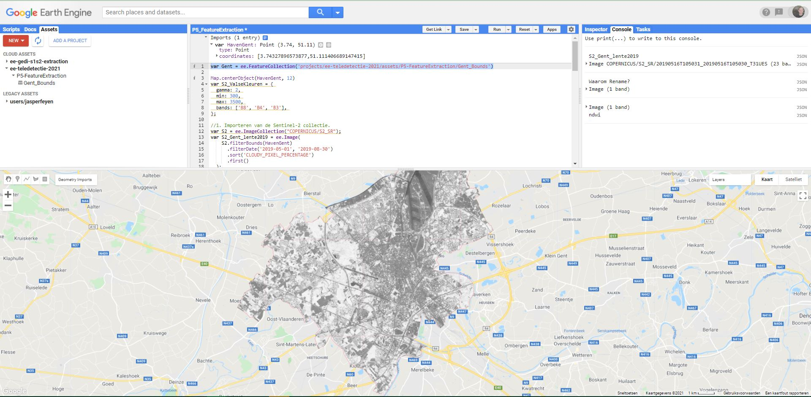

## 1. Spectral indices  

**Spectral indices** zijn combinaties van 2 of meerdere spectrale banden die gebruikt worden om bepaalde features extra in de verf te zetten of ze te herberekenen naar een relatieve schaal.

### NDVI

De meest gebruikte index is de **Normalized Difference Vegatation Index (NDVI)**, en wordt berekend als:

$$NDVI = { NIR - RED \over NIR + RED}.$$

Waarbij:  
NIR = reflectie in het nabij-infrarode gebied van het spectrum (oftwel Near-Infrared)  
RED = reflectie in het rode gebied van het spectrum  

De resulterende index krijgt waarden binnen tussen -1 en 1.  

Volgens deze formule is de densiteit van vegetatie (NDVI) op een gegeven plaats in het beeld gelijk aan de verschillen in intensiteit van het gereflecteerde licht in het rood en infrarode deel van het spectrum, gedeeld door de soms van deze intensiteiten. Vegetatie absorbeert immers een groot deel van het zichtbare licht ten behoeve van de fotosynthese (dus lage Rood-reflectie), maar weerkaatst vrijwel al het infrarode licht (hoge IR-reflectiewaarde), waardoor de ndvi stijgt. Hoe denser de vegetatie, hoe hoger de ndvi. Andere lichamen, zoals water, observeren IR dan weer beter tot zeer goed, waardoor de ndvi daalt.  


In Earth Engine kan de NDVI (en andere indices) op verschillende manieren berekend worden. We starten met de ‘meest conventionele’:  

  * We starten deze oefening door het aanmaken van een Sentinel-2 beeld in Gent. Maak een punt-geometrie aan ergens ter hoogte van de Gentse haven te Evergem.

    <p align="center">
      <br>
    </p> 

  * ** Stap 1 - Importeren en visualisatie Sentinel-2 beeld: ** Importeer de Sentinel-2 Surface Reflectance (Harmonized)  collection en zoek naar het beeld met de laagste wolkbedekking uit 2022 in de periode mei-juni (= de late lente). Bekijk op welke datum het beeld werd genomen. Visualiseer als een valse kleurencomposiet.

* ** Stap 2 ** - We beschikken tevens over de grenzen van Gent in een vectorfile (een polygoon). Voeg deze toe aan je script. De vectorfile bevat alle gemeenten in België, waaruit we Gent op basis van de 'Name'-eigenschap filteren. 

```Javascript
var Gent = ee.FeatureCollection('projects/ee-tele-2022/assets/P3-FeatureExtraction/Belgium_municipalities').filter(ee.Filter.eq('Name','Gent'))
```
  Je kunt je beeld nu verder begrenzen a.d.h.v. deze vectorfile. Gebruik hiervoor de functie ```.clip(Gent)``` die je toepast op je verkregen Sentinel-2 beeld.

??? Tip "Oplossing"
  
    ```Javascript
    // Inladen van 'shape' stad Gent
    var Gent = ee.FeatureCollection('projects/ee-tele-2022/assets/P3-FeatureExtraction/Belgium_municipalities').filter(ee.Filter.eq('Name','Gent'))

    //1. Importeren van de Sentinel-2 collectie.
    var S2 = ee.ImageCollection("COPERNICUS/S2_SR_HARMONIZED");

    //Filteren op basis van datum (lente 2022) + beeld met laagste wolkenpercentage selecteren
    var S2_Gent_Lente22 = S2.filterBounds(Gent)
        .filterDate('2022-03-20', '2022-06-30')
        .sort('CLOUDY_PIXEL_PERCENTAGE')
        .first()
	.divide(10000);

    print('Gent_Lente22:',S2_Gent_Lente22)

    //Clippen naar Grenzen Gent
    var S2_Gent_Lente22 = S2_Gent_Lente22.clip(Gent)

    //Visualisatieparameters (of handmatig instellen)
    var S2_ValseKleuren = {
      gamma: 1,
      min: 0,
      max: 0.3,
      bands: ['B8', 'B4', 'B3'],
      };

    //Toevoegen aan Map
    Map.addLayer(S2_Gent_Lente22,S2_ValseKleuren,'Valse Kleuren lente 2022')
    ```  
  
  *  ** Stap 3 - Toevoegen van de NDVI: ** Een eerste methode om een NDVI aan te maken is via de ingebouwde ```.normalizedDifference()``` functie. Ga na welke Sentinel-2 banden je nodig hebt om de ndvi te berekenen. (Maak eventueel gebruik van de ‘Docs’-tab.)  

    ```Javascript
    //2. Aanmaken NDVI via NormalDifference()-functie. Vul de '?' in
    var ndvi = S2_Gent_Lente22.normalizedDifference(['?', '?']).rename('NDVI');
    Map.addLayer(ndvi,{},'ndvi_lente_2022') //Zonder visualisatieparametes
    ```

    <p align="center">
      <br>
    </p> 
  
  * Een ndvi wordt meestal afgebeeld met een kleurenschema, zoals onderstaand voorbeeld:
   ```Javascript
   // Met visualisatie
   var ndviParams = {min: -1, max: 1, palette: ['red','yellow','darkgreen']};
   Map.addLayer(ndvi, ndviParams, 'ndvi_2022_vis');
   ```

    <p align="center">
      <br>
    </p>

???+ Question "Oefening: Connecteer de ndvi-waarden met de gepaste landbedekkingsklasse. "
    |             NDVI waarde             |         Landbedekking (Lente)         |
    |:-----------------------------------:|:-------------------------------------:|
    |         Negative values (< 0)       |           rocks, bare soil, clouds    |
    |      Small values (0.1 or less)     |           shrubs and meadows          |
    |     Moderate values (0.2 to 0.3)    |     temperate and tropical forests    |
    |       Large values (0.6 to 0.8)     |         (clouds,) water and snow      |

??? success "Antwoord"
    |             NDVI waarde             |         Landbedekking (Lente)         |
    |:-----------------------------------:|:-------------------------------------:|
    |         Negative values (< 0)       |         clouds, water and snow        |
    |      Small values (0.1 or less)     |           rocks and bare soil         |
    |     Moderate values (0.2 to 0.3)    |           shrubs and meadows          |
    |       Large values (0.6 to 0.8)     |     temperate and tropical forests    |


## 2. Bandbewerkingen

Bandbewerkingen kunnen worden gebruikt om een nieuw beeld aan te maken van de reeds bestaande banden. Het berekenen van indices zoals de NDVI, is al een treffend voorbeeld hiervan. Andere mogelijkheden zijn ratio’s, het verschil van 2 beelden op 2 verschillende tijdstippen om mogelijke veranderingen visueel te benadrukken, …

Er zijn 2 manieren om in Earth Engine een bewerking uit te voeren.

### Optie 1 - Bewerkingen via operatoren

De basisoperators maken gebruik van 2 inputs: ofwel 2 beelden, ofwel 1 beeld en 1 constante. De bewerkingen worden steeds per pixel en per band uitgevoerd. Voorbeeld van operatoren zijn  ```add()```, ```subtract()``` en ```divide()```. 

```Javascript
//NDVI berekenen aan de hand van bandwerkingen met operatoren
// Lange uitwerking: noodzakelijke banden eerst selecteren en onderbrengen in een nieuwe variabele
var nir = S2_Gent_Lente22.select('B8');
var red = S2_Gent_Lente22.select('B4');
var ndvi2 = nir.subtract(red).divide(nir.add(red)).rename('NDVI');
Map.addLayer(ndvi2, ndviParams, 'ndvi via operatoren');

```

Het resultaat is logischerwijs identiek als de voorgaande ndvi-berekening.

### Optie 2 - Bewerkingen via expressies
Het spreekt voor zich dat bovenstaande methode voor complex wiskundige bewerkingen niet handig is. Voor dergelijke bewerkingen wordt aangeraden om gebruik te maken van ```image.expression()```, gezien de inputvariabelen hier afzonderlijk worden aangegeven, waardoor de bewerking gemakkelijker wordt weergegeven en het coderen zo vereenvoudigd wordt. De expressie aanvaardt tevens ook constanten. Variabelen die binnen de expressie worden gebruikt, moeten steeds worden aangegeven, zoals in onderstaande NDVI-berekening;

```Javascript
//NDVI aan de hand van een expressie
  var ndvi3 = S2_Gent_Lente22.expression(
      '(NIR - RED)/(NIR + RED)', {
        'NIR': S2_Gent_Lente22.select('B8'),
        'RED': S2_Gent_Lente22.select('B4')
  });
```

Ook hier is het resultaat hetzelfde als de vorige ndvi-berekeningen.

???+ info "Gebruikte operators binnen expressies"
    Onderstaande tabel geeft de binnen de expressies gehanteerde operators weer (bron: [Earth Engine guide](https://developers.google.com/earth-engine/guides/image_math))
    
    <p align="center">
      <br>
    </p>


## Andere indices
Naast de NDVI bestaan er nog een heleboel andere indices, elk met een eigen toepassing.

### De Normalized Difference Water Index (NDWI)
Er bestaan 2 indices met de naam 'NDWI', beiden gerelateerd aan water:

1. De *NDWI* ontwikkeld door [Gao (1996)](https://www.sciencedirect.com/science/article/pii/S0034425796000673), als index voor het watergehalte van vegetatie. De Index is gebaseerd op de NIR (gevoelig voor vegetatie) en SWIR (gevoelig voor water) banden:

$$NDWI = { NIR - SWIR \over NIR + SWIR}.$$

2. De *NDWI* ontwikkeld door [McFeeters (1996)](https://www.tandfonline.com/doi/abs/10.1080/01431169608948714), als index voor het verscherpen van verschillen in waterlichamen;

$$NDWI = { GREEN - NIR \over GREEN + NIR}.$$

!!! note "Opdracht NDWI"
    Test beide NDWI-indices uit op het Sentinel-beeld van de Gentse Haven en omstreken. Bekijk de verschillen. Kijk hiervoor zeker naar naburige natuurgebieden en waterplassen.

## Opdrachten

### Oef 4.1 - NDVI per seizoen  seizoen

1. Maak een wolkenvrije beeldencollectie aan (gebruik een maximaal aan wolkbedekking van 30%) aan van de regio Durbuy
. Gebruik onderstaande cloudmask-functie voor Sentinel-2:  

```javascript
   function maskS2clouds(image) {
     var qa = image.select('QA60');

     // Bits 10 and 11 are clouds and cirrus, respectively.
     var cloudBitMask = 1 << 10;
     var cirrusBitMask = 1 << 11;

     // Both flags should be set to zero, indicating clear conditions.
     var mask = qa.bitwiseAnd(cloudBitMask).eq(0)
       .and(qa.bitwiseAnd(cirrusBitMask).eq(0));

     return image.updateMask(mask).copyProperties(image, ["system:time_start"]);
    }
```  
2. Maak een functie aan om de NDVI te berekenen. Laat de functie dan los op de Imagecollectie via ```.map()```.  


3. Maak aan de hand van de collectie 3 beelden aan met een ```median()```-reducer, binnen volgende periodes:  

     A. Jan-Februari (Winter)  
     B. April-Mei (Lente)  
     C. Juli-Augustus (Zomer)  

4. Visualiseer voor elk seizoen een Normale Kleurencomposiet en een NDVI-beeld. Gebruik onderstaande visualisatieparameters bij het plotten:

```javascript
//Visualisatieparameters instellen
var NormaleKleuren = {
  min: 0,
  max: 0.3,
  bands: ['B4', 'B3', 'B2'],
};

var ndviParams = {
  min: 0,
  max: 1,
  bands: ['NDVI'],
  palette: ['red','yellow','darkgreen']
};
```

!!! check "Oplossing Oefening NDVI per seizoen"
    Via deze link: [https://code.earthengine.google.com/003cf2f0a05158d3206af93b9f60c048?noload=true](https://code.earthengine.google.com/003cf2f0a05158d3206af93b9f60c048?noload=true)


## EXTRA: Toevoegen van een legende

Om een overzichtelijke legende toe te voegen aan je kaart, kun je onderstaande code gebruiken. Hiermee voeg je een legendepaneel toe voor continue ndvi-data. 

```javascript
//-------------------------
/* LEGENDE TOEVOEGEN */
//-------------------------

// set position of panel
var legend = ui.Panel({
  style: {
    position: 'bottom-left',
    padding: '8px 15px'
  }
});
 
// Create legend title
var legendTitle = ui.Label({
  value: 'ndvi',
  style: {
    fontWeight: 'bold',
    fontSize: '18px',
    margin: '0 0 4px 0',
    padding: '0'
    }
});

 // Add the title to the panel
legend.add(legendTitle); 

// create the legend image
var lon = ee.Image.pixelLonLat().select('latitude');
var gradient = lon.multiply((ndviParams.max-ndviParams.min)/100.0).add(ndviParams.min);
var legendImage = gradient.visualize(ndviParams);

// create text on top of legend
var panel = ui.Panel({
    widgets: [
      ui.Label(ndviParams['max'])
    ],
  });

legend.add(panel);
  
// create thumbnail from the image
var thumbnail = ui.Thumbnail({
  image: legendImage, 
  params: {bbox:'0,0,10,100', dimensions:'10x200'},  
  style: {padding: '1px', position: 'bottom-center'}
});

// add the thumbnail to the legend
legend.add(thumbnail);


// create text on top of legend
var panel = ui.Panel({
    widgets: [
      ui.Label(ndviParams['min'])
    ],
  });

legend.add(panel);

Map.add(legend);
```

