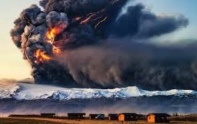

## OEF 4.1 - Classificatie van België

### Gegeven
In volgende oefening maken we een landclassificatie van België op basis van een Landsat-8 beeldcomposiet. Om de grenzen van België te bekomen, maken we gebruik van volgende dataset: [https://developers.google.com/earth-engine/datasets/catalog/USDOS_LSIB_SIMPLE_2017](https://developers.google.com/earth-engine/datasets/catalog/USDOS_LSIB_SIMPLE_2017)

Om hieruit België te filteren, maak je gebruik van onderstaande code:

```javascript
var countries = ee.FeatureCollection( 'USDOS/LSIB_SIMPLE/2017' );
var bel = countries.filterMetadata( 'country_na', 'equals', 'Belgium' );
```

### Opdracht

* Maak één wolkenvrij Landsat-8 beeld aan voor 2019. Weerhoud enkel de bruikbare banden voor classificatie: voor Landsat-8 dit zijn volgende banden: blauw, groen, rood, nir, swir1, swir2. 

* Clip je resulterende beelden op basis van de Belgische grens.

* Voer een classificatie uit met volgende klassen: *bos, water, grasland, landbouw, urban*. Maak hiervoor je eigen trainingssamples aan. Vergeet ze niet samen te voegen tot één ```FeatureCollection```.

* Kies 2 classifiers naar keuze.

* Visualiseer je resultaat naar eigen keuze. Evalueer het visueel: is je classificatie geslaagd? Welke classifier lijkt beter? 

* Bereken de *Overall Accuracy* van je classificatie. Maak gebruik van deze validatieset:  [P4_Oef1_validation.zip](https://users.ugent.be/~jfeyen/P4/P4_Oef1_validation.zip). Hierbij maak je gebruik van de eigenschap 'val', waarbij volgend schema geldt:

<center>

|  val  | Landbekkingsklasse |
|:-----:|:------------------:|
|   1   |        Bos         |
|   2   |        Water       |
|   3   |       Grasland     |
|   4   |      Landbouw      |
|   5   |       Urbaan       |


</center>

??? check "Oplossing Oef 4.1"

    Oplossing Landsat 8 Collectie 2: [https://code.earthengine.google.com/682de9333367e66955cafbc276354806](https://code.earthengine.google.com/682de9333367e66955cafbc276354806)  

    Opgelet: het spreekt voor zich dat de gebruikte trainingsvectoren in dit voorbeeld zeer rudimentair zijn, met een ruwe classificatie tot gevolg.
    Daarbij werden de testpunten ook gehaald uit een bestaande landcover classificatie van België, maar met een resolutie van 100m, waardoor de kwaliteit van de testdata niet perfect is. 
     Verder is een verbetering van het classificatieresultaat ook mogelijk door het gebruik maken van Multitemporele beelden: hiermee wordt het seizoenaal karakter van de o.a. de landbouwvelden mee in rekening gebracht, waardoor een beter onderscheid tussen o.a. grasland en landbouw (sterker temporeel karakter) behaald kan worden.


## OEF 4.2 - Eyjafjallajökull
<p align="center">
  <br>
</p>

De gletsjer Eyjafjallajökull is een van de kleinere gletsjers op IJsland en heeft een oppervlakte van ongeveer 100 km². De Eyjafjallajökull ligt ten noorden van het plaatsje Skógar. Op de oostflank van de vulkaan, nabij de bergpas Fimmvörðuháls, vond op 20 maart 2010 nieuwe vulkanische activiteit plaats. Een tweede explosievere uitbarsting in de hoofdkrater van de Eyjafjallajökull, begon op 14 april 2010. In grote delen van Europa werd het vliegverkeer dagenlang volledig stilgelegd vanwege de aswolken die de vliegtuigen kunnen beschadigen.

### Gegeven
Maak gebruik van volgend Sentinel-2 beeld en ROI, genomen in 2019:  

```javascript
var S2 = ee.Image('COPERNICUS/S2_SR/20190810T125311_20190810T125306_T27VWL')
var ROI =  ee.Geometry.Polygon(
        [[[-19.967455239503007, 63.845568279400595],
          [-19.967455239503007, 63.398959439658746],
          [-18.824877114503007, 63.398959439658746],
          [-18.824877114503007, 63.845568279400595]]], null, false);
var S2 = ee.Image('COPERNICUS/S2_SR/20190810T125311_20190810T125306_T27VWL').clip(ROI)
```

* In deze oefening gaan we geen cloud mask toevoegen, maar de wolken en wolkenschaduwen opnemen in de classificatie. 
* Training data: Chinese experten digitaliseerden verschillende polygonen in het gebied rond de vulkaan. Hierbij werd onderscheid gemaakt in 5 klassen: 
1. Gletsjer
2. Schaduw
3. Bodem
4. Vegetatie
5. Water
6. Wolken  

De Trainingfiles werden reeds ondergebracht in een ```FeatureCollection``` en kunnen via deze link worden ingelezen:

```javascript
var traindata = ee.FeatureCollection("projects/ee-teledetectie-2021/assets/P5-Classification/P5_oef2_training");
```

* **Referentie data**: tijdens een veldcampagne in 2019 werd het gebied rond de vulkaan intensief bemonsterd. Honderden pixels werden op het terrein bezocht en de landbedekking werd geregistreerd.  

Je kunt de shape-file hier downloaden: [P5_oef2_val.zip](https://users.ugent.be/~jfeyen/P5/P5_oef2_val.zip)

### Gevraagd
Classificeer het 2019 beeld met behulp van 2 supervised classifiers naar keuze. Voor de classificatie transformeer je de data, zodat je slechts 3 getransformeerde banden overhoudt die de meeste informatie bevatten. Welke accuraatheid heeft je finale model (overall/kappa)?

??? check "Oplossing Oef 5.1"
    Via een PCA kun je de Sentinel-2 banden tranformeren, zodat de eerste 3 Principale Componenten (PC) de meeste variatie (= informatie) bevattion.

    Oplossing: [https://code.earthengine.google.com/b6595b0e09f5086aed84b95826a3309f](https://code.earthengine.google.com/b6595b0e09f5086aed84b95826a3309f)