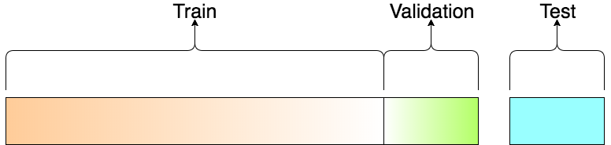
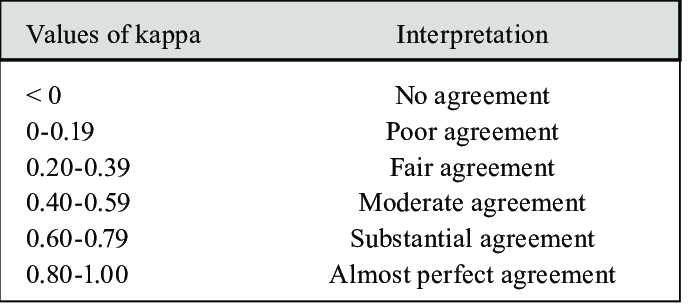

## Intro

### Achtergrond 
**Gesuperviseerde classificatie** is gebaseerd op een door de gebruiker opgestelde trainingdataset. Deze trainingsdata zijn representatief voor de specifieke gewenste klassen. Het gesuperviseerde algoritme gebruikt dan deze trainingsdata als referentie, om onbekende pixels te classificeren.

Een belangrijk element hierbij is dus voorkennis van het desbetreffende gebied. De *trainingsamples* die worden opgesteld worden ook wel *ground truth data* genoemd en komen overeen met gekende landbekking op locaties.

Er zijn verschillende opties om aan gronddata te komen:

  1. Door middel van veldbezoek, waarbij ***GPS-data*** ter plaatse worden verzameld. Deze methode zorgt voor de meest kwalitatieve data en zekerheid, maar is vanzelfsprekend duur en arbeidintensief om uit te voeren.

  2. Door gebruik van ***referentiekaarten*** of oudere beschikbaar kaartmateriaal of ***beeldmateriaal van hogere resolutie***, bijvoorbeeld beelden bekomen gedurende een drone-campagne.

  3. Door manuele ***interpretatie van de satellietbeelden***, waarbij de gebruiker beschikt over enige expertkennis en voorgaande ervaring.

Een ander aspect is dat de trainingdata zo dicht mogelijk opgenomen wordt bij het tijdstip van opname van het gebruike remote sensing beeld. Landbedekking kan immers snel veranderen: stadsontwikkeling, ontbossing, seizoenale impact, agrarische veranderingen, kusterosie, ...

In deze oefening van gesuperviseerde classificatie zul je zelf trainingsamples moeten aanmaken, want er zijn geen GPS-punten beschikbaar. Wel beschik je over een beknopt verslag van een veldcampagne, dat je een idee kan geven van de aanwezige landbekkingsklassen en aangezien we ons beperken tot enkele brede klassen, zul je tevens gemakkelijk visueel trainingsamples kunnen aanmaken. Hiervoor is het aanmaken en analyseren van verschillende composieten aangewezen.

## Beeldcomposieten aanmaken

* Start opnieuw met het aanmaken van een wolkenvrije dataset, dewelke kan overgenomen worden van vorige oefening. Belangrijk hier is ook om de gewenste banden te selecteren, die we tijdens de classificatie gaan aanmaken.

```javascript
// --------------------------------------------------------------------  
// STAP 1 - Inladen en klaarzetten van S2-beeld. Mét extra cloud-masking
// -------------------------------------------------------------------
   //Cloudprobability functie:
    // Functie die nieuwe CloudProbability collectie samenvoegt met S2 (sen2cloudless)
    // meer info: https://medium.com/sentinel-hub/cloud-masks-at-your-service-6e5b2cb2ce8a
       var getS2_SR_CLOUD_PROBABILITY = function () {
              var innerJoined = ee.Join.inner().apply({
                  primary: ee.ImageCollection("COPERNICUS/S2_SR_HARMONIZED"),
                  secondary: ee.ImageCollection("COPERNICUS/S2_CLOUD_PROBABILITY"),
                  condition: ee.Filter.equals({
                    leftField: 'system:index',
                    rightField: 'system:index'
                  })
                });
              var mergeImageBands = function (joinResult) {
                  return ee.Image(joinResult.get('primary'))
                        .addBands(joinResult.get('secondary'));
                };
              var newCollection = innerJoined.map(mergeImageBands);
              return ee.ImageCollection(newCollection);
            };
            
   // Mask out clouds
        var maskClouds = function(image) {
          var cloudProbabilityThreshold = 40;
          var cloudMask = image.select('probability').lt(cloudProbabilityThreshold);
          return image.updateMask(cloudMask).divide(10000);
        };

//Aanmaken van een ImageCollection ter hoogte van Mangroves Paramaribo, Suriname
  var S2_coll = getS2_SR_CLOUD_PROBABILITY()
        .filterDate('2021-08-01','2021-10-30')// Filteren voor het jaar 2021, droge tijd
        .filterMetadata('CLOUDY_PIXEL_PERCENTAGE','less_than',50) //Voorselectie obv wolken
        .map(maskClouds) //toepassen van de cloudmaskfunctie
        .filterBounds(ROI); //collectie filteren obv de Kustzonegeometrie
  
//print('Sentinel-2_collectie, S2_coll)

//Omzetten collectie naar een Image, door .median() te nemen. Hierna clippen we ook tot onze ROI
//Ook selecteren we de banden waarmee we verder willen werken
var bands = ['B2','B3','B4','B5','B6','B7','B8','B8A','B11','B12'];

var S2_im = S2_coll.median()
                     .select(bands)
                     .clip(ROI) //Bekijk de .clip-eigenschappen in de Docs
                     
Map.centerObject(S2_im, 11)
Map.addLayer(S2_im,{min:0.05,max:0.1800,bands:'B4,B3,B2'},'NormaleKleuren_2021',0)
Map.addLayer(S2_im,{min:0.0700,max:0.4500,bands:'B8,B4,B3'},'ValseKleuren_2021',0)
Map.addLayer(S2_im,{min:0.0500,max:0.4000,bands:'B8,B11,B2'},'Healthy_Vegetation_2021',0)
```

## Trainingsamples aanmaken

> "Whereas the actual classification of multispectral image data is a highly automated process, assembling the training data needed for classification is anything but automatic. In many ways, the training effort required in supervised classification is both an art and a science"
> **Lillesand & Kiefer (pg 544)**


* Nadat het wolkenvrije Sentinel-2 beeld is ingeladen, kunnen we deze gebruiken om enkele representatieve *samples* te verzamelen van enkele landbedekkingklassen waar we in geïnteresseerd zijn. Er zijn 2 manieren om trainingsdata in Earth Engine op te laden:

    1. Door ze in te tekenen als polygonen binnen per klasse, zoals we in komend voorbeeld zullen toepassen.

    2. Door eerder ingetekende trainingssamples of GPS-punten op te laden als een 'Asset'. Dit kunnen *shapefiles*, of *.csv*-bestanden zijn.

* Hover met je muis over de *'Geometry Imports* box, dat zich naast de geometrietools bevindt. Klik op *'+new layer'.

* Elke gewenste landbedekkingsklasse dient als een afzonderlijke laag te worden aangemaakt. Laat ons bijvoorbeeld starten met de eenvoudigste klasse 'water'. Zoom in op het beeld en teken polygonen in over oppervlaktes waar je zeker van bent dat het waterlichamen betreft. Het is goed hierin te variëren binnen verschillende types van zowel zee als rivieren en andere waterlichamen. Teken ca. 10 polygonen in per klasse. Neem hiervoor zeker je tijd, gezien het belangrijk is dit zeer precies te doen. De kwaliteit van de inputdata bepaalt tevens de kwaliteit van de classificatie, oftewel *Garbage in = Garbage out*. Als je een fout gemaakt heb, kun je even op 'exit' duwen en de laats ingetekende polygoon verwijderen.

<center>
| class | Landbekkingsklasse |
|:-----:|:------------------:|
|   1   |      Mangrove      |
|   2   |     OtherForest    |
|   3   |        Water       |
|   4   |        Crop        |
|   5   |        Urban       |
|   6   |      BareSoil      |

</center>


<p align="center">
    <br>
</p> 

???+ warning "Polygonen vs puntdata als traingdata"
     Trainingdata kan bestaan uit puntdata of trainingdata. Beiden hebben hun voor- en nadeel.  

     **Puntdata** gebruiken als inputdata kan bijvoorbeeld als je beschikt over een grote set GPS-veldpunten van locaties waar je exact weet tot welke landbedekkingsklasse een pixel hoort. Deze pixel wordt dan als referentie aanschouwt. Deze zekerheid van de trainingsdata is dus groot. Een nadeel bij pixels is dat het minder de variëteit van de pixels binnen de klasse opneemt en de totale set aan trainingspixels beperkt blijft.  

     **Polygonen** worden gebruikt om gebieden in te tekenen voor een bepaalde klasse. In earth engine wordt elke pixel binnen deze polygoon dan gebruikt als inputdata. Dit zorgt ervoor dat de trainingsset groter wordt en de variatie binnen een bepaalde klasse beter wordt omvat. Een nadeel is echter dat zo ook foute pixels kunnen worden meegenomen door het onzorgvuldig intekenen van de polygoon.  

* Eenmaal je klaar bent met het intekenen van een klasse, kun je deze import configureren. Klink hiervoor op het tandwieltje naast de klasse. Geef het een gepaste naam. Daarna verander je de 'Import as' van *geometry* naar type *FeatureCollection*. Voeg daarna een *property* toe met de naam 'class', door te klikken op *'Add property'*. De eerste klasse geef je waarde 1, de 2e 2, .... Zorg er wel voor dat je goed weet welke waarde je aan welke klasse geeft. Neem hierbij eventueel de *class*-numering over van bovenstaande tabel.

<p align="center">
    <br>
</p> 

* Herhaal dit voor elke klasse. Uiteindelijk verschijnt elke klasse als een '*FeatureCollection*' bij de imports-lijst in je script:

<p align="center">
    <br>
</p> 

<p align="center">
    <br>
 <em> Voorbeeld trainingsamples voor Mangrove </em>
</p> 


* Nu de 5 klassen aangemaakt zijn, dienen we ze samen te vatten als een complete trainingsset in earth engine; een gezamenlijke ```FeatureCollection```, waarbij de 'class'-*property* wordt overgenomen.

```javascript
//2. Trainingssamples samenvoegen tot 1 ```FeatureCollection```

var classNames = Mangrove.merge(OtherForest).merge(Water).merge(Crop).merge(Urban).merge(BareSoil);
print(classNames)
```
<p align="center">
    <br>
</p> 

## De trainingsdata aanmaken

Nu hebben we reeds een ```FeatureCollection```met trainingspolygonen, maar deze zeggen nog niks over de trainingspixels. In een volgende stap, extraheren we de trainingspixels per band uit het Sentinel-2 beeld op basis van de aangemaakte polygonen. Dit doen we met de ```sampleRegions()```functie. Deze functie extraheert alle pixels binnen opgegeven polygonen, en schrijft elke pixel afzonderlijk naar een nieuw ````Feature```binnen een ```FeatureCollection```, dewelke ook de class-property meekrijgen. Afhankelijk van de grootte van de polygonen, kan deze dataset dus zeer lijvig worden.

```javascript
//Trainingspixels extraheren naar featurecollection = trainingsdata
var traindata = S2_im.sampleRegions({
  collection: classNames, //De trainingspolygonen
  properties: ['class'], //Dit neemt de gewenste eigenschappen van de collection over
  scale: 10,
  tileScale:4
});
print('Aantal trainingspixels: ',traindata.size());
//print(traindata) //Niet doen
print(traindata.first()) //Eerste waarde bekijken,
```
!!! warning "Layer error: Computed value is too Large"
    Mogelijks heb je bij het gebruik van sampleRegions() al onderstaande foutmelding gehad:  
    <p align="center">
      <br>
    </p> 
    Dit krijg je dus als je berekening de maximum-memorycapaciteit overschrijdt. Dit is eenvoudig op te lossen door het toevoegen van een extra parameter ```tileScale``` aand de sampleRegions()-functie, zoals in bovenstaand voorbeeld werd gedaan. Door het verhogen van de ```tileScale``` zal Earth Engine de opdracht in meerdere stukjes indelen, waardoor de berekening minder gemakkelijk *'out of memory'* zal lopen. De bewerking zal hierdoor wel meer tijd in beslag nemen, dus verhoog tileScale slechts gelijdelijk.  

   Zie ook de 'Docs' van sampleRegions()
    


## De classifier trainen
In een volgende stap maken we een classificatiemodel aan en trainen we deze op basis van de traindata. Er bestaan verschillende mogelijke classifiers en 'machine learning'-algoritmen. In Google Earth Engine zitten deze beschikbaar in de ```ee.Classifier```-groep. We gebruiken er 3, waarna we kijken dewelke tot de meest accurate classificatie leidt o.b.v. de validatiedata.

### Minimum Distance Classifier

In een eerste instantie dienen we de classifier te trainen, op basis van de opgestelde trainingsdata. We dienen ook aan te geven welke van de *properties* binnen de trainingssamples de 'class'-bevat, en welke *properties* gebruikt moeten worden om mee te classificeren (de banden).


```javascript
//4. De classifiers trainen en toepassen
   // A. Minimum Distance classifier (gebruik van default-waarde 'euclidische afstand')
    var MinDist = ee.Classifier.minimumDistance().train({
      features: traindata,
      classProperty: 'class',
      inputProperties: bands //verwijzing naar de eerder aangemaakte bands-lijst
    });

```


### CART classifier

```javascript
// B. CART classifier
    var Cart = ee.Classifier.smileCart().train({
      features: traindata,
      classProperty: 'class',
      inputProperties: bands //verwijzing naar de eerder aangemaakte bands-lijst
    });
```

### Random Forest classifier

```javascript
 // C. Random Forest
    var RandomForest = ee.Classifier.smileRandomForest({
      numberOfTrees: 60
    }).train({
      features: traindata,
      classProperty: 'class',
      inputProperties: bands //verwijzing naar de eerder aangemaakte bands-lijst
    });
```

## Beeld classificeren en visualiseren

Eenmaal de classifier(s) opgesteld zijn, kunnen ze worden toegepast op het volledige S2-beeld. Elke pixel wordt dus toegekend tot een klasse, op basis van de kennis opgedaan uit de trainingsdata.

```javascript
// 5. Classifiers toepassen

  //MinimumDistance
    var classified_MD = S2_im.classify(MinDist)
    var classified_CART = S2_im.classify(Cart)
    var classified_RF = S2_im.classify(RandomForest)

```

Bij het visualiseren willen we een visueel overzichtelijk resultaat krijgen. Aangezien we eindigen met discrete klassen, stellen we hiervoor een palette op, dat per klasse een kleur aangeeft.

```javascript
 var palette = [
    'FF0000', // mangrove (1)  // rood
    '7CFC00', //  ander bos (2) // lichtgroen
    '1E90FF', //water (3) // blauw
    'FFFD10', //crop (4) //geel
    '000000', //stad // zwart
    '876829', //BareSoil // bruin
  ];
  
  var classvis = {min:1, max:6, palette: palette}

   Map.addLayer(classified_MD,classvis,'MinimumDistance')
   Map.addLayer(classified_CART,classvis,'CART')
   Map.addLayer(classified_RF,classvis,'RandomForest')
```

## Accuraatheidsbepaling (Accuracy assessment)

In de *accuracy assessment* toetsen we de bruikbaarheid van het classificatiemodel: welke foutenmarge is er aanwezig? Dit doen we op basis van een foutenmatrix (**error matrix**). Om deze op te stellen hebben we nood aan een set van (onafhankelijke) testdata. We willen met andere woorden weten hoe goed onbekende pixels worden geclassificeerd door de classifier.

### Training- Validation en Testdata
Een veel gebruikte methode bij het opstellen van modellen, is het opsplitsen van de *trainingset*-dataset in training- en validatiedata. Hierbij wordt de *training*data at random gesplits in meestal een 80/20-verhouding. Daarnaast wordt er vak nog gebruik gemaakt van een derde, volledig afzonderlijke dataset: de **testdataset**:

<p align="center">
    <br>
</p> 


> **Traindata**= de data gebruikt om het model te trainen en dus te *fitten*. Het model bekijkt en leert van deze data.

> **Validatiedata**= Het deel van de data dat gebruikt zal worden om na te gaan hoe goed het model werkt op onbekende data. Dit deel zal dus niet gebruikt worden om het model te trainen. Hierdoor kunnen verschillende classificatiemodellen en parameters binnen het model tegenover elkaar worden afgewogen en het model zo worden geperfectioneerd. Dit wordt ook wel *parameter tuning* genoemd. Validatiedata wordt dus gebruikt tijdens de ontwikkeling en het zoeken van het beste model. Bij spatiale data echter, dient hier voorzichtig mee te worden omgegaan door het fenomeen van *spatiale autocorrelatie*. Hierbij zijn de validatiepixels veelal buurpixels van de trainpixels. Dit is het geval wanneer er bijvoorbeeld gebruik gemaakt wordt van polygonen als inputdata.

> **Testdata** = Deze afzonderlijke dataset wordt gebruikt om bij een finaal model accuraatheidsmaten van de bekomen classificatie te berekenen. Testdatasets worden meestal ook zeer goed verzorgd en zijn goed verzamelde (veld)datapunten. De *spatiale autocorrelatie* vervalt hier.

### De Error Matrix: interpretatie

!!! info "Zie ook de foutenmatrix handboek pagina 577"

De Error Matrix wordt opgesteld door het vergelijken van de geclassificeerde testdata-waarden en de referentiedata. Onderstaande matrix geeft een voorbeeld van dergelijke matrix:

<p align="center">
    <br>
</p> 

* **Rijen**: resulaat van de classificatie
* **Kolommen**: validatie data
* **Diagonaal**: pixels die goed geclassificeerd zijn (validatie data = classificatie)
* **Niet-diagonaal**:  

      - **Omissie**: de niet diagonale kolom-elementen. Deze pixels behoren tot een klasse, maar werden ingedeeld in een verkeerde klasse. In het voorbeeld: 18 pixels moesten Mangrove zijn, maar werden ingedeeld onder andere klassen: 1 als 'Dead Mangrove', 8 als *Other Forest*, 7 als *Other Vegetation* en 2 als *Water.  

      - **Commissie**: Deze pixels geven aan welke pixels verkeerd werden ingedeeld in deze klasse. Voor *Water* zijn dit er bijvoorbeeld 2 (moesten *'Dead Mangrove'*) + 2 (moest *Mangrove* zijn + 1 (moest *Other Vegetation* zijn) = 5 pixels verkeerdelijk als *'Water'* ingedeeld.  

Op basis van de error matrix kunnen er enkele **accuraatheidsmaten** worden berekend.

- **Overall accuracy**: Dit is de som van de diagonale elementen, gedeeld door het totaal aantal pixels (= "juist ingedeeld"/totaal).

- **Producer accuracy**:  het aantal correct ingedeeld pixels in elke klasse, gedeeld door het aantal validatiepixels van die klassen. Het geeft een indicatie hoe goed de validatiepixels geclassificeerd werden (Bijvoorbeeld Mangrove = (125/143 = 87,41% werd goed geclassificeerd)). Deze maat geeft de probabiliteit weer dat een pixel die in een bepaalde klasse werd gestopt in werkelijkheid ook tot die klasse behoort. 

- **User/consumer accurcay**: Het aantal correct geclassificeerde pixels in elke klasse (diagonaalelementen), gedeeld door het aantal pixels ingedeeld in die klasse (rijtotaal). 

- **Kappa (KHAT) index**: de kappa index is een gecorrigeerde accuraatheidsmaat, die intra- en interobserver agreement in rekening houdt. Het houdt m.a.w. rekening met pixels die per toeval juist geclassificeerd zijn. Onderstaande tabel geeft een interpretatie weer van de kappa-waarde.
<p align="center">
    <br>
</p> 

### De Error matrix in Earth Engine
#### Inlezen van de Testdataset
In voorliggend voorbeeld maken we gebruik van een extra testdataset voor het opstellen van de error matrix. Gezien we geen optimalisatie van parameters gaan doorvoeren, maken we geen gebruik van validatiedata en wordt de volledige trainingscollectie ook trainingsdata.

De gebruikte testdataset bestaat uit kleine polygonen met een diameter van 25m en representeren GPS-punten genomen op veldbezoek. De 25m-buffer rond de GPS-punten werd genomen om voldoende testpixels te weerhouden voor de accuracy assessment.

Je kunt de shape-file hier downloaden: [P4_testdata_poly.zip](https://users.ugent.be/~jfeyen/P4/P4_testdata_poly.zip)

Om deze toe te voegen aan Earth Engine, laad je deze op via de 'Asset'-tab. Daarna kun je het importeren als een ```FeatureCollection``` in je script. Noem dit 'Testdata_pol'. Bekijk ook even deze polygonen. Onder welke *property* zitten de klassen hier opgeslagen?

<p align="center">
    <br>
</p> 

Vervolgens extraheren we de pixelwaarden op basis van deze testpolygonen, net zoals we dit gedaan hebben bij de trainingspixels:

```javascript
//Na inlezen van validatiedata: maak een testdatacollectie, zoals bij het opmaken van traindata
print('Testpolygonen',Testdata_pol) //bekijk de properties

//Testpixels extraheren naar featurecollection
var testdata = S2_im.sampleRegions({
  collection: Testdata_pol, //De trainingspolygonen
  properties: ['val'], //Dit neemt de gewenste eigenschappen van de collection over
  scale: 10
});
print('Aantal testpixels: ',traindata.size());
```

Nu we de testpixelwaarden geëxtraheerd hebben, kunnen we deze vergelijken met de geclassificeerde pixels in een **error matrix**. Tevens staat Earth Engine een rechtstreekse berekening van de verschillende accuraatheidsmaten toe. In onderstaand stukje code staat het voorbeeld voor de Minimum Distance classifier. Pas dit toe voor alle classifiers. Welke classifier heeft de grootste algemene accuraatheid (*Overall accuracy*)? 

```javascript
// Validatie met de testdata
var val_MinDist = testdata.classify(MinDist);
var ErrorMatrix_MinDist = val_MinDist.errorMatrix('val', 'classification')

print('MinDist Validation error matrix: ', ErrorMatrix_MinDist.array().transpose());
print('MinDist Validation overall accuracy: ', ErrorMatrix_MinDist.accuracy());
print('MinDist Producer Accuracy: ', ErrorMatrix_MinDist.producersAccuracy());
print('MinDist User/Consumer Accuracy: ', ErrorMatrix_MinDist.consumersAccuracy());
print('Kappa index: ', ErrorMatrix_MinDist.kappa());

//Omzetten naar een Feature + transpose
var ErrorMatrix_MinDist = ee.Feature(null, {matrix: ErrorMatrix_MinDist.array().transpose()}); 

```

!!! warning "De Error matrix in Earth Engine"
    In Earth Engine wordt de error matrix opgeroepen met de ```ee.ConfusionMatrix()```-functie. Resulterend is een lijst met 7 elementen (de rijen), waarbij elke rij op zijn beurt bestaat uit 7 elementen (de kolommen). In Earth Engine corresponderen de rijen met de referentiedata en de kolommen met de geclassificeerde data. Met de ```array.().transpose()``` functie kunnen we deze matrix transponeren, zodat deze overeenkomst met de matrix in het voorbeeld (kolommen: referentie, rijen: geclassificeerd), wat de standaard weergave is.
    <p align="center">
      <br>
    </p> 
    Daarnaast wordt ook klasse '0' meegerekend in de berekening. Gezien deze in ons voorbeeld niet bestaat, zal de 1e rij/kolom enkel 0-waarden bevatten.


## Voorbeeld: interpretatie error matrix

In ons voorbeeldje werd onderstaande ErrorMatrix verkregen voor de MinDist classifier. Door de ```.transpose()```-functie komt de referentiedata terecht in de kolommen, terwijl de classificatiedata zich in de rijen bevindt.

<p align="center">
  <br>
</p> 

Na wat opschoning in excel, ziet de error matrix van dit voorbeeld er uit als volgt:
<p align="center">
  <br>
</p>

Welke klassen scoren goed? Welke zijn minder accuraat? Aan de *overall accurcay* en de *Kappa index* kan worden afgeleid dat de classificatie reeds een goede indicatie heeft, maar nog voor verbetering vatbaar is. Hoofdzakelijk de klassen 'water' en 'crop' scoren goed, terwijl 'Soil' moeilijker te onderscheiden valt van 'crop' en 'urban'. Betere trainingsdata is hier dus de boodschap!

## Extra: Exporteren van de Error Matrix

In Google Earth Engine is de weergave van de error matrix niet zo handig. Om verdere accuraatheidsmaten uit te rekenen en een betere interpretatie te kunnen uitvoeren kan het handig zijn om de error matrix te exporteren als een .csv-bestand, dewelke in andere software (zoals excel) geopend kan worden. 

Met de ```Export.table.toDrive()```-functie kunnen we de matrix exporteren naar onze Google Drive. Hiervoor dienen we dit eerst om te zetten naar een *feature*.


```javascript
//Omzetten naar een Feature
var ErrorMatrix_MinDist = ee.Feature(null, {matrix: ErrorMatrix_MinDist.array()}); 
   
//Exporteren van de errormatrix
  Export.table.toDrive({
      collection: ee.FeatureCollection(ErrorMatrix_MinDist),
      description: 'P4_Errormatrix',
      fileFormat: 'CSV',
      folder: 'TELEDETECTIE_2022'
    });
```

??? info "Volledig script"
    Via deze link: [https://code.earthengine.google.com/ee3fc3029e84e0baf24728dbe4f2bb6f](https://code.earthengine.google.com/ee3fc3029e84e0baf24728dbe4f2bb6f)


