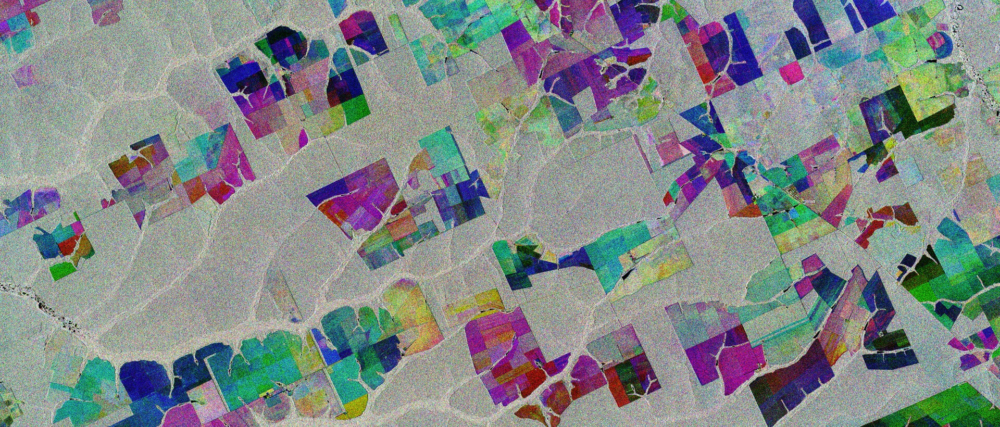
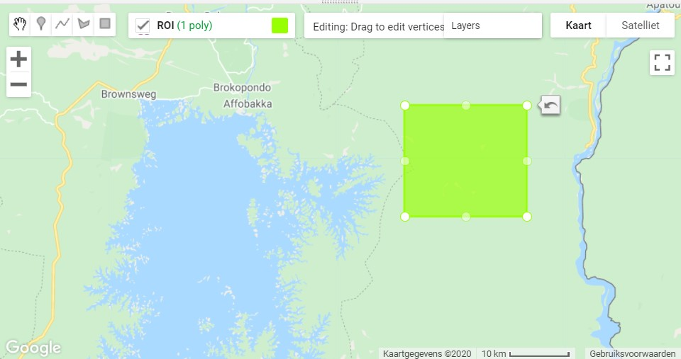

<p align="center">
  <br>
<em> Sentinel-1 composite Mato Groso, Brazil. (Source: [BELSPO](https://eo.belspo.be/nl/news/sentinel-1-captures-mato-grosso)) </em>
</p>   


## SAR: *'Synthetic Aperture Radar'*

Dit laatste onderdeel vormt een introductie tot het verwerken en visualizeren van SAR-data in Google Earth Engine. SAR staat voor *'Synthetic Aperture Radar'* (NL: Apertuursyntheseradar). Het is wellicht het meest gebruikte type Radar-systeem binnen de Remote Sensing en biedt hoge resolutie radarbeelden. 

Het voordeel van Radar ten opzichte van multispectrale beelden:

- SAR-golven penetreren door wolkbedekking, waardoor wolken geen belemmering vormen tijden het monitoren van landbekking. Zeker in tropische landen is dit een sterk voordeel gedurende grote regenperiodes.

- Afhankelijk van het type SAR, penetreren de SAR-golven (gedeeltelijk) doorheen het kronendak, waardoor betere biomassa- en structuurinschattingen mogelijk worden. Over het algemeen geldt: hoe groter de golflengte, hoe dieper de SAR-golven penetreren.

- SAR remote sensing is een actieve vorm van teledetectie: de satelliet zorgt zelf voor energiebron. Hierdoor is het ook tijdsonafhankelijk en kan het zowel gedurende de dag als nacht opereren.

Bijgevolg zijn de meest frequente toepassingen van SAR bosmonitoring, flood mapping en disaster management,  [The SAR handbook (NASA, 2019)](https://servirglobal.net/Global/Articles/Article/2674/sar-handbook-comprehensive-methodologies-for-forest-monitoring-and-biomass-estimation) vormt een uitstekend handboek waar zowel de theoretische achtergrond als enkele toepassingen worden uitgelicht.

Onderstaande voorbeelden hebben als doel een introductie te bieden tot het gebruik van SAR in Google Earth Engine. Er wordt gewerkt met Sentinel-1 data.

??? info "Over Sentinel-1"
    <p align="center">
      <br>
    </p>   

    Sentinel-1 is een onderdeel van het ESA Copernicus-programma. Deze missie bestaat net zoals Sentinel-2 uit twee satellieten die 180° tegenoverklaar in orbit rond de aarde zweven. De waarnemingen gebeuren in de C-band (ca. 5,405 GHZ). Beide satellieten zorgen er gezamenlijk voor dat de volledige aardbol minstens elke 2 weken volledig wordt gedekt. De meest voorkomende S1-doelstellingen zijn:
    
    * Het opvolgen van zee-ijs verschuivingen  
    * In kaart brengen van humanitaire hulp in crisistijd  
    * Monitoring van het mariene milieu  
    * Monitoring van landbouw en bosbouw  

## Voorbeeld 1 - Kartering van overstromingen met Sentinel-1

??? info "Link naar het volledige script:"
    [https://code.earthengine.google.com/4856b647703cccf6e03fcbf4acc2f16c](https://code.earthengine.google.com/4856b647703cccf6e03fcbf4acc2f16c)


### Achtergrond

SAR-gebaseerde overstromingskartering is een betrouwbare en snelle manier een inschatting te verkrijgen van de oppervlakte waarover een overstroming zich heeft uitgestrekt. Gezien de onafhankelijkheid van de weersomstandigheden, kan deze cruciale informatie steeds asap worden afgeleid.

In wat volgt bekijken we een methode om op een snelle en eenvoudige manier dergelijke inschatting te maken, op basis van een analyse op 2 tijdstippen: voor en na een overstroming.

* Het studiegebied betreft Pakistan, waar in 2022  het landschap danig aanttaste. De tol: naar schatting 1800 doden en duizenden die hun woning zagen verdwijnen. Daarnaast werd een enorme schade opgetekend aan de infrastructuur van ongeveer $15 miljard. We analyseren in deze oefening de impact (op grotere schaal) binnen de provincie Sindh, één van de zwaarder getroffen regio's.

* Studiegebied: ```var ROI = ee.FeatureCollection("projects/ee-tele-2022/assets/Sindh");```


### Visualiseren van Sentinel-1 data

* Als eerste stap, filteren we de S1 collectie. Hierbij werken we uit eenvoud met de VV polarisatie. Let op de naamgeving van je studiegebied.


??? check "Code"
    ```javascript
    // Inladen van Sentinel-1 collectie
    var S1_VV = ee.ImageCollection('COPERNICUS/S1_GRD')
            //.filter(ee.Filter.listContains('transmitterReceiverPolarisation', 'VV'))
            .filter(ee.Filter.eq('instrumentMode', 'IW'))
            .filterBounds(ROI)
            .select('VV')
            .map(function(image) {
              var edge = image.lt(-30.0);
              var maskedImage = image.mask().and(edge.not());
              return image.updateMask(maskedImage);
            });

    // Richting van S1-overtoch is van belang: hier enkel de 'descending' richting nemen
    var desc = S1_VV.filter(ee.Filter.eq('orbitProperties_pass', 'DESCENDING'));
            
    ```
* Maak vervolgens 2 afzonderlijke beelden aan; een VV-polarisatie binnen de periode 20 augustus t.e.m. 15 september 2021 (ter referentie) en 20 augustus t.e.m. 15 september 2022, de periode net na de grootste overstroming.


??? check "Code"
    ```javascript
    //Voor floods (2021)
    var VV_2021 = desc.filterDate('2021-08-20','2021-09-15')
    // Na floods (2022)
    var VV_2022 = desc.filterDate('2022-08-20','2022-09-15')

    // Bekijken van de geselecteerde collecties:
    print('Tiles selected: Before Flood', VV_2021)//5 beelden
    print('Tiles selected: After Flood', VV_2022)//12 beelden

    ```

* Hierna kunnen we 2 VV-beelden aanmaken met een mean()-reducer: Voor- en na. Tevens zorgen we voor een 'speckle'-filter dat het peper-zout effect typerend aan radar wat reduceert. Hierna kunnen we het beeld visualiseren.


??? check "Code"
    ```javascript 
    //------------------------------  DISPLAY PRODUCTS  ----------------------------------//
    // Before and after flood SAR mosaic
    Map.centerObject(ROI,8);
    //Voor floods (2021)
    var imgVV_2021 = VV_2021.mean().clip(ROI)
    // Na floods (2022)
    var imgVV_2022 = VV_2022.mean().clip(ROI)
    // Peper-zout effect filteren (Speckle Filter)
    var smoothing_radius = 50;
    imgVV_2021 = imgVV_2021.focal_mean(smoothing_radius, 'circle', 'meters');
    imgVV_2022 = imgVV_2022.focal_mean(smoothing_radius, 'circle', 'meters');
    Map.addLayer(imgVV_2021,{min:-23,max:0}'VV August 2021')
    Map.addLayer(imgVV_2022,{min:-23,max:0},'VV August 2022')

    ```


* We hebben nu de 2 VV-beelden (NA/VOOR de overstroming). Op basis van de ratio beide, kunnen we informatie over de impact van de overstroming achterhalen. Neem de ratio (Na/voor). Aangezien water doorgaans een lagere 'backscatter' heeft, zal dit dus resulteren in een nieuwe laag waar de overstroomde gebieden een hogere waarde krijgen (want Voor = geen water = hogere (minder negatief) backscatter, Na = overstroomd = lagere (negatievere) backscatter.)

* Vervolgens nemen we een treshold (via trial/error), waarbij enkel de waarden in het verschilbeeld groter dan 1.25 worden behouden (```.gt()```-functie). Het resultaat is een binair raster.

??? check "Code"
    ```javascript
    //------------------------------- Berekening overstromingsgeboed -------------------------------//

    // Calculate the difference between the before and after images
    var difference = imgVV_2022.divide(imgVV_2021);
    var threshold = 1.25; //Via Trial- and error dit bekomen
    var difference_binary = difference.gt(threshold);

    ```

Volgend stukje code verfijnt het verschilbeeld op basis van additionele datasets. Hierdoor worden de seizoenale overstromingen en de rivieroppervlakten (die dus geen onderdeel van de ramp zijn) uit het verschilbeeld weerhouden. Daarnaast zorgt een pixelconnectiveitsberekening ook dat enkele pixels worden gewist en enkel de 'grotere' vlakken overblijven.

* Maak eeb 'mask' aan, waarbij de oppevlaktewaterpixels van (eizoenaal) overstroomde gebieden worden verwijderd (gebieden met water gedurende minstens 10 maand op een jaar). Gebruik hiervoor het ```ee.Image('JRC/GSW1_0/GlobalSurfaceWater')``` beeld.

```javascript
    // Refine flood result using additional datasets
          
          // Include JRC layer on surface water seasonality to mask flood pixels from areas
          // of "permanent" water (where there is water > 10 months of the year)
          var swater = ee.Image('JRC/GSW1_0/GlobalSurfaceWater').select('seasonality');
          var swater_mask = swater.gte(10).updateMask(swater.gte(10));
          
          //Flooded layer where perennial water bodies (water > 10 mo/yr) is assigned a 0 value
          var flooded_mask = difference_binary.where(swater_mask,0);
          // final flooded area without pixels in perennial waterbodies
          var flooded = flooded_mask.updateMask(flooded_mask);
          
          // Compute connectivity of pixels to eliminate those connected to 8 or fewer neighbours
          // This operation reduces noise of the flood extent product 
          var connections = flooded.connectedPixelCount();    
          var flooded = flooded.updateMask(connections.gte(8));
```

* Op basis van het verkregen ```flooded```-beeld kunnen we oppervlakteberekeningen uitvoeren. Bereken de oppervlakte van het overstromingsgebied in Ha. (Zie practicum 4)


??? check "Code" 

    ```javascript
    // Calculate flood extent area
    // Create a raster layer containing the area information of each pixel 
    var flood_pixelarea = flooded.select('VV')
      .multiply(ee.Image.pixelArea());
  
    // Som van de overstroomde pixels
    // Gebruik de 'bestEffort: true' om de berekening te vereenvoudigen, voor een  
    // accurater resultaat, zet bestEffort naar "false" en zet een hogere waarde voor 'maxPixels'. 
    var flood_stats = flood_pixelarea.reduceRegion({
      reducer: ee.Reducer.sum(),              
      geometry: ROI,
      scale: 10, // resolutie Sentinel-1 pixel
      //maxPixels: 1e9,
      bestEffort: true
      });

    // Converteer de oppervlakte van het overstromingsgebied naar hectare. rond ag.
    var flood_area_ha = flood_stats
      .getNumber('VV')
      .divide(10000)
      .round(); 
    ```

Tot slot visualiseren we ons resultaat:

```javascript
// Difference layer
Map.addLayer(difference,{min:0,max:2},"Difference Layer",0);

// Flooded areas
Map.addLayer(flooded,{palette:"0000FF"},'Flooded areas');

print('Oppervlakte overstromingsgebied',flood_area_ha)

```

??? info "Bronvermelding"
    Inspiratie voor bovenstaande code via [UN-Spider](https://code.earthengine.google.com/f5c2f984c053c8ea574bfcd4040d084e).


### Opdracht
* Bekijk bovenstaande code voor het gebied. Lees het even door en ga na welke stappen er in de procedure werden opgenomen.

* Bereken hoeveel oppervlakte aan Landbouwgebied werd overstroomd. Gebruik hiervoor een 'LandCover'-kaart, zoals: [https://developers.google.com/earth-engine/datasets/catalog/COPERNICUS_Landcover_100m_Proba-V-C3_Global](https://developers.google.com/earth-engine/datasets/catalog/COPERNICUS_Landcover_100m_Proba-V-C3_Global). Tip: maak een binair raster van het gewenste oppervlakte en maskeer hierbij de 'overstromingslaag' met deze gebieden.


??? check "Oplossing"
    Via dit scriptje: [https://code.earthengine.google.com/70bf32b42c7f233120352fc5fc1134f5](https://code.earthengine.google.com/70bf32b42c7f233120352fc5fc1134f5)


## Voorbeeld 2 - Near-Real Time Forest Monitoring (NRTM)

### Over NRTM
**Near-Real Time Forest Monitoring** of **NRTM** is het principe waarbij bosbedekking in gebieden met veel illegale houtkap, van nabij wordt gemonitord waarbij steeds meest recente beschikbare satellietdata wordt gebruikt om eventuele wijzigingen in het kronendak op te sporen. Hierdoor kunnen eventuele illegale houtkapactiviteiten worden onderschept en stopgezet, om erger te vermijden.

### Visualiseren van Sentinel-1 data

* Open een nieuw scriptje in Earth Engine.

* Zoek naar Sentinel-1 in de zoekbalk en lees kort de achtergrondinformatie door.
<p align="center">
  <br>
</p>  

* Sentinel-1 beelden bevat verschillende polarisaties: HH, HV, VV, VH. Uit de theorieles weten we dat bijvoorbeeld 'VV' staat voor verticaal gepolariseerd signaal uit en verticaal gepolariseerd resultaat ontvangen. 

* We starten met de Sentinel-1 collectie (in earth engine: COPERNICUS/S1_GRD) in te laden en te filteren op basis van een Region of interest. In dit geval focussen we ons op een stuk tropisch regenwoud, ten oosten van het Brokopondo-meer in Suriname.
<p align="center">
  <br>
</p> 

```javascript
// Load Sentinel 1 C band SAR Ground Range collection (log scale, VV, descending)

Map.centerObject(ROI,13);
//VV-polarisatie
var VV_coll = ee.ImageCollection('COPERNICUS/S1_GRD')
        .filter(ee.Filter.listContains('transmitterReceiverPolarisation', 'VV'))
        .filter(ee.Filter.eq('instrumentMode', 'IW'))
        .filter(ee.Filter.eq('orbitProperties_pass','DESCENDING'))
        .select('VV')
        .map(function(image) {
          var edge = image.lt(-30.0);
          var maskedImage = image.mask().and(edge.not());
          return image.updateMask(maskedImage);
        });

//VH-polarisatie
var VH_coll = ee.ImageCollection('COPERNICUS/S1_GRD')
        .filter(ee.Filter.listContains('transmitterReceiverPolarisation', 'VH'))
        .filter(ee.Filter.eq('instrumentMode', 'IW'))
        .filter(ee.Filter.eq('orbitProperties_pass','DESCENDING'))
        .select('VH')
        .map(function(image) {
          var edge = image.lt(-30.0);
          var maskedImage = image.mask().and(edge.not());
          return image.updateMask(maskedImage);
        });
        
```

* In dit voorbeeld bekijke we voor 3 tijdstippen de verandering in bosbedekking van dit gebiedje; 2019, 2020, 2021. Maak 3 VV_beelden aan per jaar. Neem een gemiddelde pixelwaarde (dus een reducer) voor de maand Augustus. Je kunt hierbij dezelfde methodiek gebruiken als bij multispectrale data.
```javascript
// Filteren op basis van locatie en tijdstip    
var VV_2019= VV_coll.filterBounds(ROI).filterDate('2019-08-01','2019-08-31').mean()
```

* Laat ons eens bekijken hoe elk afzonderlijk VV-gepolariseerd er per jaar uitziet. Visualiseer de 3 beelden in je project. Hanteer hierbij steeds dezelfde visualisatieparameters.

```javascript
var VV_Param = {"opacity":1,"bands":["VV"],"min":-12.695602621422937,"max":-2.5938492158251467,"gamma":1}; 
// Afzonderlijke beelden mappen: visueel weinig verschil te zien
Map.addLayer(VV_2019,VV_Param,'VV_2019',0)
Map.addLayer(VV_2020,VV_Param,'VV_2020',0)
Map.addLayer(VV_2021,VV_Param,'VV_2021',0)
```


* Op zich bieden de beelden afzonderlijk weinig informatie. In een volgende stappen creëren we een beeldcomposiet, met volgende samenstelling: RGB= ['VV_2019', 'VV_2020', 'VV_2021']. Wat valt je op? Tip: om losse beelden samen te voegen tot één image gebruik je de ```.addBands()``` functie. Analyseer je resultaat.

```javascript
//Afzonderlijke jaren samenvoegen
var VV_yearly = ee.Image(VV_2019).addBands(VV_2020).addBands(VV_2021);
Map.addLayer(VV_yearly, {min: -20, max: -5},'VV_2019_2020_2021')
```

* Vervolgens kunnen we het verschil tussen 2 jaren wat verder analyseren. Onderstaande redenering is als volgt: door het verschil te nemen tussen het beeld VV_2021 en VV_2019, worden de pixels waar in 2019 wel nog bos aanwezig was, maar in 2021 niet meer negatief. Uit trial-and-error kun je bij grove benadering stellen de verschilwaarden van (VV_2021-VV_2021) tussen -6 en -15 overeenkomen met ontbossing. Voer dus volgende stappen uit:  
    1. Neem het verschil tussen 2021 en 2021.  
    2. Rond de waarden af naar boven met de ```.ceil()```-functie.
    3. Reclassificeer de waarden tussen -6 en -15 naar een waarde 1 met de ```.remap()``` functie

```javascript
//Tussen 2 jaren: verschil nemen (2021 - 2019)
var VV_20192021 = VV_2021.subtract(VV_2019)

//Verschilbeeld illustreren
Map.addLayer(VV_20192021,{min:-13, max:10},'Diff_2021_2019')

// REMAP: om verlies te bepalen (-6 tot -15 komt grofweg overeen met ontbossing)
var VV_20192021= VV_20212021.ceil(); // afronden naar boven
var loss_20192021= VV_20292021.remap([-6,-7,-8,-9,-10,-11,-12,-13,-14,-15],[1,1,1,1,1,1,1,1,1,1])

Map.addLayer(loss_20192021,{palette: 'red'},'Loss_20219_2021')
```

* Plot tevens ook 2 Sentinel-2-beelden (van 2019 en 2021) en bekijk ook hier de ontbossing.

### Opdracht 1: Mangrove monitoring met SAR

* Bekijk aan de hand van bovenstaand voorbeeld ook de wijzigingen in het mangrovegebied langs de volledige kustlijn in Suriname. Tussen 2018-2021. Wat valt je op? Welk type ontbossing is dit?

* Benader ook de **aanwas** van mangrove tussen deze jaren. De verschilwaarden tussen 7 en 
13 kun je als grove grenzen nemen als wat 'aanwas' van mangrove is.


