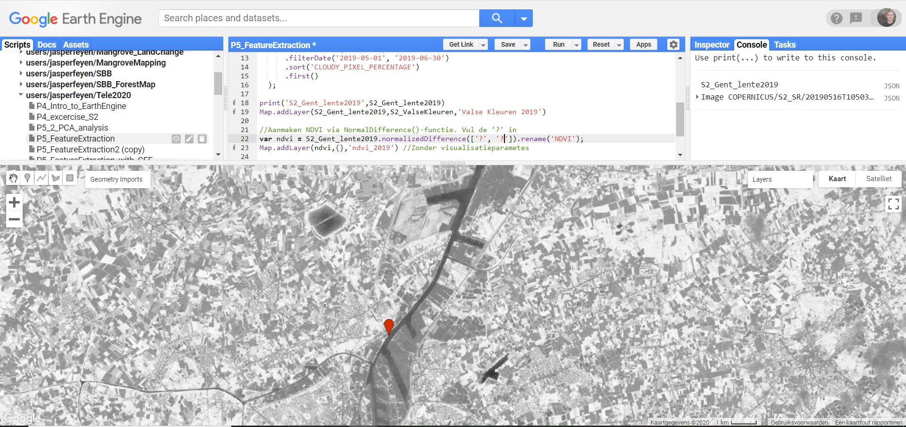
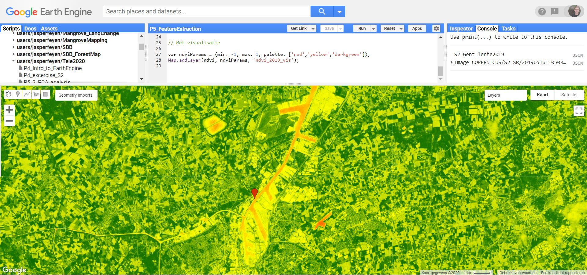

## Spectral indices  

**Spectral indices** zijn combinaties van 2 of meerdere spectrale banden die gebruikt worden om bepaalde features extra in de verf te zetten of ze te herberekenen naar een relatieve schaal.

### NDVI

De meest gebruikte index is de **Normalized Difference Vegatation Index (NDVI)**, en wordt berekend als:

$$NDVI = { IR - RED \over IR + RED}.$$

Waarbij:  
NIR = reflectie in het nabij-infrarode gebied van het spectrum (oftwel Near-Infrared)  
RED = reflectie in het rode gebied van het spectrum  

De resulterende index krijgt waarden binnen tussen -1 en 1.  

Volgens deze formule is de densiteit van vegetatie (NDVI) op een gegeven plaats in het beeld gelijk aan de verschillen in intensiteit van het gereflecteerde licht in het rood en infrarode deel van het spectrum, gedeeld door de soms van deze intensiteiten. Vegetatie absorbeert immers een groot deel van het zichtbare licht ten behoeve van de fotosynthese (dus lage Rood-reflectie), maar weerkaatst vrijwel al het infrarode licht (hoge IR-reflectiewaarde), waardoor de ndvi stijgt. Hoe denser de vegetatie, hoe hoger de ndvi. Andere lichamen, zoals water, observeren IR dan weer beter tot zeer goed, waardoor de ndvi daalt.

In Earth Engine kan de NDVI op verschillende manieren berekend worden. We starten met de ‘meest conventionele’. 

1.  We starten deze oefening in de Gentse haven. Maal een puntsymbool aan ergens ter hoogte van de Gentse haven in Evergem.

    <p align="center">
      <br>
    </p> 

2.  Importeer de Sentinel-2 Surface Reflectance (Tier 1) collection en zoek naar het beeld met de laagste wolkbedekking uit 2019 in de periode mei-juni (= de late lente). Bekijk van welke datum het beeld afkomstig is. Visualiseer als een valse kleurencomposiet  
  
    ```Javascript
    //1. Importeren van de Sentinel-2 collectie.
    var S2 = ee.ImageCollection("COPERNICUS/S2_SR");

    //Filteren op basis van datum (lente 2019) + beeld met laagste wolkenpercentage selecteren
    var S2_Gent_Lente19 = S2.filterBounds(HavenGent)
        .filterDate('2019-03-20', '2019-06-30')
        .sort('CLOUDY_PIXEL_PERCENTAGE')
        .first();

    print('Gent_Lente19:',S2_Gent_Lente19)

    //Visualisatieparameters (of handmatig instellen)
    var S2_ValseKleuren = {
      gamma: 2,
      min: 275,
      max: 2088,
      bands: ['B8', 'B4', 'B3'],
      };

    //Toevoegen aan Map
    Map.addLayer(S2_Gent_Lente19,S2_ValseKleuren,'Valse Kleuren lente 2019')
    ```  
  
3.  Een eerste methode om een NDVI aan te maken is via de ingebouwde ```.normalizedDifference()``` functie. Ga na welke Sentinel-2 banden je nodig hebt om de ndvi te berekenen. (Maak eventueel gebruik van de ‘Docs’-tab.)  

    ```Javascript
    //2. Aanmaken NDVI via NormalDifference()-functie. Vul de '?' in
    var ndvi = S2_Gent_Lente19.normalizedDifference(['?', '?']).rename('NDVI');
    Map.addLayer(ndvi,{},'ndvi_lente_2019') //Zonder visualisatieparametes
    ```

    <p align="center">
      <br>
    </p> 
  
4. Een ndvi wordt meestal afgebeeld met een kleurenschema, zoals onderstaand voorbeeld:
   ```Javascript
   // Met visualisatie
   var ndviParams = {min: -1, max: 1, palette: ['red','yellow','darkgreen']};
   Map.addLayer(ndvi, ndviParams, 'ndvi_2019_vis');
   ```

    <p align="center">
      <br>
    </p>

???+ Question "Oefening: Connecteer de ndvi-waarden met de gepaste landbedekkingsklasse. "
    |             NDVI waarde             |         Landbedekking (Lente)         |
    |:-----------------------------------:|:-------------------------------------:|
    |         Negative values (< 0)       |           rocks, bare soil, clouds    |
    |      Small values (0.1 or less)     |           shrubs and meadows          |
    |     Moderate values (0.2 to 0.3)    |     temperate and tropical forests    |
    |       Large values (0.6 to 0.8)     |         (clouds,) water and snow      |

??? success "Antwoord"
    |             NDVI waarde             |         Landbedekking (Lente)         |
    |:-----------------------------------:|:-------------------------------------:|
    |         Negative values (< 0)       |         clouds, water and snow        |
    |      Small values (0.1 or less)     |           rocks and bare soil         |
    |     Moderate values (0.2 to 0.3)    |           shrubs and meadows          |
    |       Large values (0.6 to 0.8)     |     temperate and tropical forests    |


## Band Math (bandbewerkingen)

Bandbewerkingen kunnen worden gebruikt om een nieuw beeld aan te maken van de reeds bestaande banden. Het berekenen van indices zoals de NDVI, is al een treffend voorbeeld hiervan. Andere mogelijkheden zijn ratio’s, het verschil van 2 beelden op 2 verschillende tijdstippen om mogelijke veranderingen visueel te benadrukken, …

Er zijn 2 manieren om in Earth Engine een bewerking uit te voeren.

### Bewerkingen via operatoren

De basisoperators maken gebruik van 2 inputs: ofwel 2 beelden, ofwel 1 beeld en 1 constante. De bewerkingen worden steeds per pixel en per band uitgevoerd. Voorbeeld van operatoren zijn  ```add()```, ```subtract()``` en ```divide()```. 

```Javascript
//NDVI berekenen aan de hand van bandwerkingen met operatoren
// Lange uitwerking: noodzakelijke banden eerst selecteren en onderbrengen in een nieuwe variabele
var nir = S2_Gent_lente2019.select('B5');
var red = S2_Gent_lente2019.select('B4');
var ndvi2 = nir.subtract(red).divide(nir.add(red)).rename('NDVI');
Map.addLayer(ndvi, ndviParams, 'ndvi via operatoren');

```

Het resultaat is logischerwijs identiek als de voorgaande ndvi-berekening.

### Bewerkingen via expressies
Het spreekt voor zich dat bovenstaande methode voor complex wiskundige bewerkingen niet handig is. Voor dergelijke bewerkingen wordt aangeraden om gebruik te maken van ```image.expression()```, gezien de inputvariabelen hier afzonderlijk worden aangegeven, waardoor de bewerking gemakkelijker wordt weergegeven en het coderen zo vereenvoudigd wordt. De expressie aanvaardt tevens ook constanten. Variabelen die binnen de expressie worden gebruikt, moeten steeds worden aangegeven, zoals in onderstaande NDVI-berekening;

```Javascript
//NDVI aan de hand van een expressie
  var ndvi3 = S2_Gent_lente2019.expression(
      '(NIR - RED)/(NIR + RED)', {
        'NIR': S2_Gent_lente2019.select('B8'),
        'RED': S2_Gent_lente2019.select('B4')
  });
```

Ook hier is het resultaat hetzelfde als de vorige ndvi-berekeningen.

???+ info "Gebruikte operators binnen expressies"
    Onderstaande tabel geeft de binnen de expressies gehanteerde operators weer (bron: [Earth Engine guide](https://developers.google.com/earth-engine/guides/image_math))
    
    <p align="center">
      <br>
    </p>

## Opdrachten
### De *Enhanced Vegetation Index* (EVI): 
De EVI is gelijkaardig aan de NDVI daar het gebruikt wordt om de aanwezigheid (of     ‘greenness’) van vegetatie a.d.h.v. satellietbeelden te kwantificeren. Het werd     ontwikkeld om aan enkele “limitaties” van de ndvi te voldoen:  

 * EVI is gevoeliger voor gebieden met hogere biomassa
 * EVI reduceert de invloed van de atmosferische condities
 * EVI corrigeert de *‘canopy background noise’*, die bij NDVI voorkomt
    
De EVI wordt berekend als volgt:
    
$$EVI = G * {NIR - R \over NIR + C1 * RED – C2*BLUE + L}.$$

(waarbij \(G\): een versterkende constante, \(C1,C2\) coëfficienten en \(L\) een *‘canopy background adjusment factor’*) 

Voor Sentinel 2, wordt deze formule:
$$EVI_{S2} = 2.5 * {B8 - B4 \over B8 + 6 * B4 – 7.5*B2 + 1}.$$


