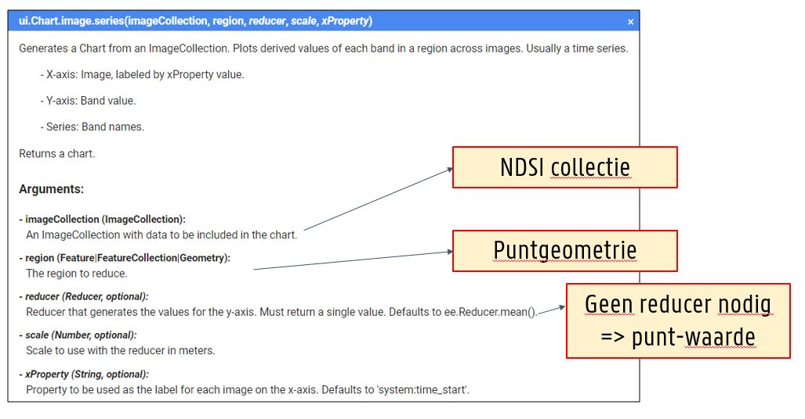

Tijdserie analyse is een veel gebruikte operatie in Remote Sensing. Het draagt immers bij tot het modelleren van temporele (seizoenaal of lange termijn) patronen en het monitoren van landcover. Gezien het grote (historische) aanbod aan RS data is Google Earth Engine een zeer geschikt medium om tijdseries te gaan analyseren.

## Tijdserieplots aanmaken in Google Earth Engine

### De Normalized Difference Snow Index (NDSI)

<p align="center">
  <br>
</p> 

In onderstaand voorbeeldje bekijken we de aanwezigheid van sneeuw in de Alpen doorheen de afgelopen jaren. Hiervoor maken we gebruik van alweer een nieuwe index: de **Normalized Difference Snow Index (NDSI)**. Deze index wordt gebruikt om de aanwezigheid van sneeuw/ijs te accentueren, ten opzichte van de andere landbekkingsklassen waaronder wolken. De NDSI maakt echter geen onderscheid tussen waterlichamen en sneeuw. 

De NDSI wordt berekend als: 

$$NDSI = { GREEN - SWIR \over GREEN + SWIR}.$$

### Opdracht: NDSI-tijdseries
Zet ergens een willekeurig punt in de Alpen.

Vervolgens initieren we een Sentinel-2 collectie, maar ditmaal gebruik makend van de TOA-collectie (dus de niet atmosferisch gecorrigeerde Sentinel-2 collectie). De reden dat we deze collectie hier gaan gebruiken, is omdat het een groter temporeel bereik heeft binnen Earth Engine (2015 - ...), terwijl de Sentinel-2 'Surfance Reflectance' pas vanaf 2019 wereldwijd systematisch wordt toegevoegd.

In volgende wordt:  

- De NDSI berekend en toegevoegd over de beeldcollectie
- De beeldcollectie wordt gefilterd op basis van de ROI.
- Het beeld met minste wolkbedekking gevisualiseerd
- De NDSI voor dit beeld gevisualiseerd.

??? check "Scriptje"
    [code](https://code.earthengine.google.com/735391c2fec3a4cb3d847d0714bdb34c)


### Charts
Naast de capaciteit voor beeldverwerking en visualisatie is Google Earth Engine ook een goed platform voor het aanmaken van enkele  standaard-grafieken: pie charts, bar charts, column charts, line charts, ...

In dit voorbeeld maken we een lijnplot (line chart) aan voor de NDSI. Aangezien we een de NDSI-waarde over het volledige bereik van de ```Imagecollection``` willen plotten voor het geplaatste punt, maken we gebruik van een **ui.Chart.image.series**.

<p align="center">
  <br>
<em> De Chart.image.series-functie, met de voornaamste functie-parameters. </em>
</p>

Ingevuld met de noodzakelijke parameters ziet deze functie eruit als volgt. Zoals andere zaken in Earth Engine, wordt de Chart eerst als een variabele aangemaakt.


```javascript
/ Create and display a time series chart
print('Time series of NDSI at a random point in the Alpes');
var Chart = ui.Chart.image.series(S2.select('NDSI'), ROI, ee.Reducer.mean(), 100);
```

De layout van een Chart nog worden aangepast met de ```setOptions()```-functie. Met de parameters ```hAxis``` & ```vAxis``` kun je een titel toekennen aan de assen.


```javascript
print(Chart.setOptions({
  hAxis: {title: 'Time (-)'},   //hAxis is een functie op zich
  vAxis: {title: 'Index mean (-)'},
  lineWidth: 2,
  pointSize: 4,
  interpolateNulls: true,
  legend: {position: 'upper right'}
}));
```

### Day of Year (DOY) plot. 

Een andere visualisatiemogelijkheid is om de NDSI per jaar te plotten als 'Day of Year' (DOY)? In plaats van een doorlopende lijnplot, wordt hierbij de NDSI-waarden binnen elkar jaar als een afzonderlijke lijn geplot. Dit is m.a.w. bruikbaar om verschillende jaren te vergelijken.

```javascript
// Create and display a DOY time series chart
print(ui.Chart.image.doySeriesByYear(S2, 'NDSI', ROI, ee.Reducer.mean(), 10).setOptions({
  hAxis: {title: 'DOY (-)'},
  vAxis: {title: 'NDSI (-)'},
  lineWidth: 2,
  pointSize: 4,
  interpolateNulls: true,
  legend: {position: 'upper right'}
}));

```

## Opdracht

Visualiseer en analyseer de landdynamica op 3 locaties gebaseerd op basis van Sentinel-2 beelden:  

 
 * Verdeel één der volgende [locaties](https://code.earthengine.google.com/ceeefb643efa7c93503d5b8ba1d8da0e) onder je buren en vergelijk:  

    - Greenland
    - Amazon
    - Botswana
    - Portugal
    - Namibia
    - Indonesia
    - Slovenia

 * Plot verschillende indices: NDVI, MNDWI en NDSI  
 * Deel de resultaten met elkaar bespreek de variatie binnen doorheen de verschillende jaren. 

??? check "Oplossingen"
    - [Greenland](https://code.earthengine.google.com/0909deed3f6a849dda1e5774f964fd79)  
    - [Amazon](https://code.earthengine.google.com/dd524b73865d4300322753dfab15ba0b)  
    - [Botswana (Okavango delta)](https://code.earthengine.google.com/551915a0408c6b96178a767a16afa9d2) 
    - [Portugal](https://code.earthengine.google.com/6e4eaeedeab338a498ff637026189e76)  
    - [Namibia (Etosha pan)](https://code.earthengine.google.com/75729b5e683a7d08e2588c648545bb4f)  
    - [Indonesia](https://code.earthengine.google.com/887bbf279fd7a6e5b074712e4a36dc1f)  
    - [Slovenia](https://code.earthengine.google.com/b73f08ba7f58752a336a8d5faa7e9b1d)

## Overige voorbeelden

* NDWI tijdseries van het Titicaca meer (één polygoon): [https://code.earthengine.google.com/c68262aa235a78f60e898099601863a1](https://code.earthengine.google.com/c68262aa235a78f60e898099601863a1)

* Temperatuur tijdseries over verschillende punten wereldwijd:
[https://code.earthengine.google.com/470d63bbdc73a3800804c7dca9811ba3](https://code.earthengine.google.com/470d63bbdc73a3800804c7dca9811ba3)