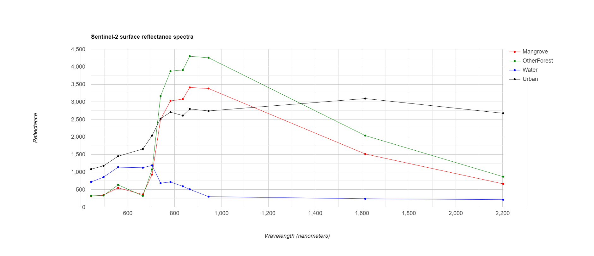

Als laatste onderdeel van dit practicum, kijken we even naar de spectrale signaturen van onze klassen. Uit deze curves kunnen we volgende zaken afleiden (zie ook Practicum 1):

  * Welke banden/indices zorgen voor onderscheid tussen klassen?
  
  * Welk spectrale curves heeft elk van onze klassen? Kunnen we deze curves ook verklaren?

## Aanmaken voorbeeldFeatures

Om spectrale curves te maken, hebben we eveneens voorbeeld-samples nodig van elk van de klassen. Dit kan door opnieuw nieuwe *features* in te tekenen (bv één punt voor 1 klasse). We doen dit bijvoorbeeld voor de klassen Mangrove, OtherForest, Water en Urban. Zoek één representatief punt voor elk van de klassen. Maak deze aan als het type *Feature* en geef het een *property* 'label', met een bijpassende naam


<p align="center">
    <br>
</p> 

<p align="center">
    <br>
</p> 

Eenmaal de VoorbeeldFeatures zijn aangemaakt kun je ze samenvoegen in het script:

```javascript
var vbPol = ee.FeatureCollection([Mangrove,OtherForest,Water,Urban]);
```
## S2-beeld aanmaken

Maak ook opnieuw het Sentinel-2 beeld uit vorige oefening aan, met de indices:

```javascript
// --------------------------------------------------------------------  
// STAP 1 - Inladen en klaarzetten van S2-beeld. Mét extra cloud-masking
// -------------------------------------------------------------------
   //Cloudprobability functie:
    // Functie die nieuwe CloudProbability collectie samenvoegt met S2 (sen2cloudless)
    // meer info: https://medium.com/sentinel-hub/cloud-masks-at-your-service-6e5b2cb2ce8a
       var getS2_SR_CLOUD_PROBABILITY = function () {
              var innerJoined = ee.Join.inner().apply({
                  primary: ee.ImageCollection("COPERNICUS/S2_SR"),
                  secondary: ee.ImageCollection("COPERNICUS/S2_CLOUD_PROBABILITY"),
                  condition: ee.Filter.equals({
                    leftField: 'system:index',
                    rightField: 'system:index'
                  })
                });
              var mergeImageBands = function (joinResult) {
                  return ee.Image(joinResult.get('primary'))
                        .addBands(joinResult.get('secondary'));
                };
              var newCollection = innerJoined.map(mergeImageBands);
              return ee.ImageCollection(newCollection);
            };
            
   // Mask out clouds
        var maskClouds = function(image) {
          var cloudProbabilityThreshold = 40;
          var cloudMask = image.select('probability').lt(cloudProbabilityThreshold);
          return image.updateMask(cloudMask);
        };

//Aanmaken van een ImageCollection ter hoogte van Mangroves Paramaribo, Suriname
  var S2_coll = getS2_SR_CLOUD_PROBABILITY()
        .filterDate('2019-08-01','2019-10-30')// Filteren voor het jaar 2020, droge tijd
        .filterMetadata('CLOUDY_PIXEL_PERCENTAGE','less_than',50) //Voorselectie obv wolken
        .map(maskClouds) //toepassen van de cloudmaskfunctie
        .filterBounds(ROI); //collectie filteren obv de Kustzonegeometrie
        

// -----------------------------------------------------------------------------
// TOEVOEGEN INDICES
// -----------------------------------------------------------------------------

var addIndices = function (image) {
      var mvi = image.expression('(B8-B3)/(B11-B3)', {
        'B8' : image.select('B8'),
        'B3': image.select('B3'),
        'B11' : image.select('B11')
      }).float().rename('MVI');
      var ndvi = image.normalizedDifference(['B8', 'B4']).rename('NDVI');
      var ndwi = image.normalizedDifference(['B3', 'B12']).rename('NDWI');
      return image.addBands(mvi).addBands(ndvi).addBands(ndwi);
      };

//Toepassen indices + medianreducer + clippen      
var S2_im = S2_coll.map(addIndices).median().clip(Paramaribo);
```

!!! info "Cloud mask methode"
    In voorgaande code wordt opnieuw gebruik gemaakt van de extra S2-cloudmask methode. Je kunt evengoed gebruik maken van de andere strategiën, zoals gezien in "Cloud Masking" van Practicum 4.

## Spectrale responsiecurve aanmaken 

Vervolgens kunnen we de Chart aanmaken. Tevens linken we de overeenkomstige golflengtes aan de banden, om zo een spectrum te krijgen met de golflengte in de X-as.

```javascript
// Golflengtes S2


//De overeenkomstige golflengte per band aangeven (zie bandenverdeling Sentinel-2).
var wavelengths =[443.9,496.6,559,664.5,703.9,740.2,782.5,835.1,864.8,945,1613.7,2202.4]


//Aanmaken Chart
var Chart = ui.Chart.image.regions({
  image: S2_im.select(bands),
  regions: vbPol,
  reducer: ee.Reducer.mean(),
  scale: 10,
  seriesProperty: 'label',
  xLabels: wavelengths
})

var plotOptions = {
  title: 'Sentinel-2 surface reflectance spectra',
  hAxis: {title: 'Wavelength (nanometers)'},
  vAxis: {title: 'Reflectance'},
  lineWidth: 1,
  pointSize: 4,
  series: {
    0: {color: 'red'}, // Mangrove
    1: {color: 'green'}, // Forest
    2: {color: 'blue'}, // water
    3: {color: 'black'}, //crops/grass
  }};

print(Chart.setOptions(plotOptions));
```

<p align="center">
    <br>
</p> 