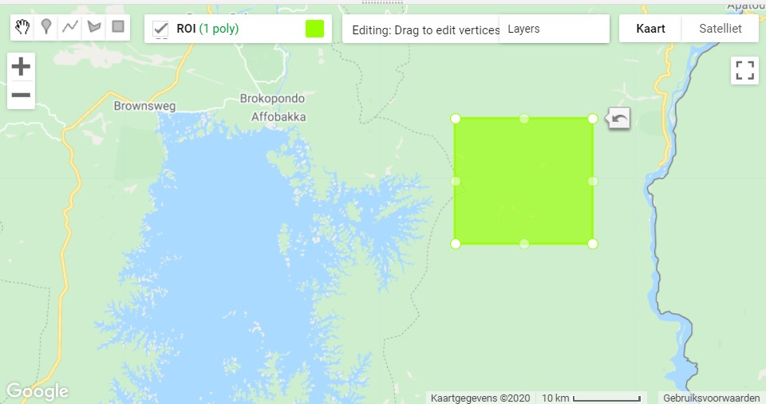
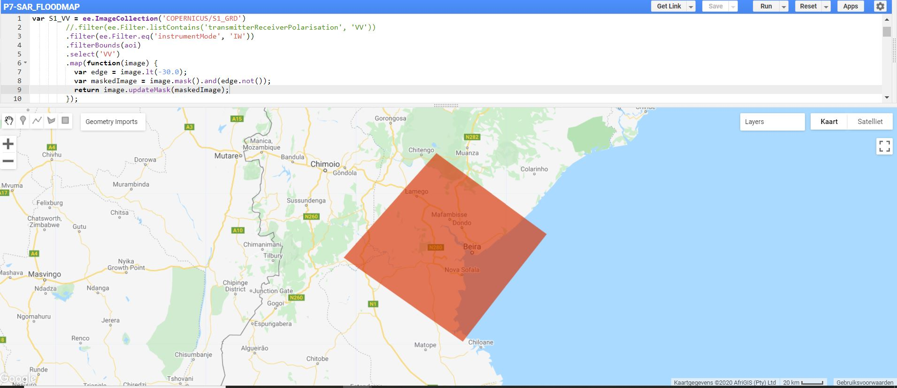

<p align="center">
  <br>
<em> Sentinel-1 composite Mato Groso, Brazil. (Source: [BELSPO](https://eo.belspo.be/nl/news/sentinel-1-captures-mato-grosso)) </em>
</p>   

## SAR: *'Synthetic Aperture Radar'*

Dit laatste onderdeel vormt een introductie tot het verwerken en bekijken van SAR-data in Google Earth Engine. SAR staat voor *'Synthetic Aperture Radar'* (NL: Apertuursyntheseradar). Het is wellicht het meest gebruikte type Radar-systeem binnen de Remote Sensing en biedt hoge resolutie radarbeelden.

Het voordeel van Radar ten opzichte van multispectrale beelden:

- SAR-golven penetreren door wolkbedekking, waardoor wolken geen belemmering vormen tijden het monitoren van landbekking. Zeker in tropische landen biedt deze capaciteit van een sterk voordeel bv tegen illegale ontbossing gedurende grote regenperiodes.

- Afhankelijk van het type SAR, penetreren de SAR-golven (gedeeltelijk) doorheen het kronendak, waardoor betere biomassa- en structuurinschattingen mogelijk zijn.

- SAR remote sensing is een actieve vorm van teledetectie: de satelliet zorgt zelf voor energiebron. Hierdoor is het ook tijdsonafhankelijk en kan het zowel gedurende de dag- als nacht opereren.

Bijgevolg is SAR een uitstekend middel om aan bosmonitoring, flood mapping en disaster management te doen. Voor de geïnteresseerden: [The SAR handbook (NASA, 2019)](https://servirglobal.net/Global/Articles/Article/2674/sar-handbook-comprehensive-methodologies-for-forest-monitoring-and-biomass-estimation) vormt een uitstekend handboek waar zowel de theoretische achtergrond als enkele toepassingen worden uitgelicht.


Onderstaande voorbeelden hebben als doel slechts een introductie te bieden tot het gebruik van SAR in Google Earth Engine. Er wordt gewerkt met Sentinel-1 data.

??? info "Over Sentinel-1"
    <p align="center">
      <br>
    </p>   

    Sentinel-1 is een onderdeel van het ESA Copernicus-programma. Deze missie bestaat net zoals Sentinel-2 uit twee satellieten die 180° tegenoverklaar in orbit rond de aarde zweven. De waarnemingen gebeuren in de C-band (ca. 5,405 GHZ). Door deze positie dekt de missie om de twee weken de totale aarde. De meest voorkomende S1-doelstellingen zijn:
    
    * Het opvolgen van zee-ijs verschuivingen  
    * In kaart brengen van humanitaire hulp in crisistijd  
    * Monitoring van het mariene milieu  
    * Monitoring van landbouw en bosbouw  


## Voorbeeld 1 - Near-Real Time Forest Monitoring (NRTM)

### Over NRTM
**Near-Real Time Forest Monitoring** of **NRTM** is het principe waarbij bosbedekking in gebieden met veel illegale houtkap, van nabij wordt gemonitord waarbij steeds meest recente beschikbare satellietdata wordt gebruikt om eventuele wijzigingen in het kronendak op te sporen. Hierdoor kunnen eventuele illegale houtkapactiviteiten worden onderschept en stopgezet, om erger te vermijden.

### Visualiseren van Sentinel-1 data

* Open een nieuw scriptje in Earth Engine.

* Zoek naar Sentinel-1 in de zoekbalk en lees kort de achtergrondinformatie door.
<p align="center">
  <br>
</p>  

* Sentinel-1 beelden bevat verschillende polarisaties: HH, HV, VV, VH. Uit de theorieles weten we dat bijvoorbeeld 'VV' staat voor verticaal gepolariseerd signaal uit en verticaal gepolariseerd resultaat ontvangen. 

* We starten met de Sentinel-1 collectie (in earth engine: COPERNICUS/S1_GRD) in te laden en te filteren op basis van een Region of interest. In dit geval focussen we ons op een stuk tropisch regenwoud, ten oosten van het Brokopondo-meer in Suriname.
<p align="center">
  <br>
</p> 

```javascript
// Load Sentinel 1 C band SAR Ground Range collection (log scale, VV, descending)

Map.centerObject(ROI,13);
//VV-polarisatie
var VV_coll = ee.ImageCollection('COPERNICUS/S1_GRD')
        .filter(ee.Filter.listContains('transmitterReceiverPolarisation', 'VV'))
        .filter(ee.Filter.eq('instrumentMode', 'IW'))
        .filter(ee.Filter.eq('orbitProperties_pass','DESCENDING'))
        .select('VV')
        .map(function(image) {
          var edge = image.lt(-30.0);
          var maskedImage = image.mask().and(edge.not());
          return image.updateMask(maskedImage);
        });

//VH-polarisatie
var VH_coll = ee.ImageCollection('COPERNICUS/S1_GRD')
        .filter(ee.Filter.listContains('transmitterReceiverPolarisation', 'VH'))
        .filter(ee.Filter.eq('instrumentMode', 'IW'))
        .filter(ee.Filter.eq('orbitProperties_pass','DESCENDING'))
        .select('VH')
        .map(function(image) {
          var edge = image.lt(-30.0);
          var maskedImage = image.mask().and(edge.not());
          return image.updateMask(maskedImage);
        });
        
```

* In dit voorbeeld bekijke we voor 3 tijdstippen de verandering in bosbedekking van dit gebiedje; 2017, 2018, 2019. Maak 3 VV_beelden aan per jaar. Hieronder een voorbeeldje voor 2017. We nemen de gemiddelde waarde voor de periode Augustus.
```javascript
// Filteren op basis van locatie en tijdstip    
var VV_2017= VV_coll.filterBounds(ROI).filterDate('2017-08-01','2017-08-31').mean()
```

* Laat ons eens bekijken hoe elk afzonderlijk VV-gepolariseerd beeld per jaar er uit ziet:
var VV_Param = {"opacity":1,"bands":["VV"],"min":-12.695602621422937,"max":-2.5938492158251467,"gamma":1}; 
// Afzonderlijke beelden mappen: visueel weinig verschil te zien
Map.addLayer(VV_2017,VV_Param,'VV_2017',0)
Map.addLayer(VV_2018,VV_Param,'VV_2018',0)
Map.addLayer(VV_2018,VV_Param,'VV_2019',0)

* Doe nu hetzelfde, maar voor de VH-polarisatie. Bekijk in welke maat de sensitiviteit voor verschillende landoppervlakten verschilt in beide polarisaties.

* Op zich bieden de beelden afzonderlijk weinig informatie. In een volgende stappen creëeren we een beeldcomposiet, met volgende samenstelling: RGB= ['VV_2017', 'VV_2018', 'VV_2019']. Wat valt je op?

```javascript
//Afzonderlijke jaren samenvoegen
var VV_yearly = ee.Image(VV_2017).addBands(VV_2018).addBands(VV_2019);
Map.addLayer(VV_yearly, {min: -20, max: -5},'VV_2017_2018_2019')
```

* Tracht nu ook hetzelfde te doen voor de VH_polarisaties.

* Laat ons nu even kijken naar de verschillen tussen 2 jaren. Onderstaande redenering is als volgt: door het aftrekken van VV_2017 van VV_2019, worden de pixels waar in 2017 wel nog bos waren, maar in 2019 niet meer negatief. Uit trial-and-error weten we dat bij grove benadering de verschilwaarden van (VV_2019-VV_2017) tussen -6 en -15 overeenkomen met ontbossing.

```javascript
//Tussen 2 jaren: verschil nemen (2019 - 2017)
var VV_20172019 = VV_2019.subtract(VV_2017)

//Verschilbeeld illustreren
Map.addLayer(VV_20172019,{min:-13, max:10},'Diff_2017_2019')

// REMAP: om verlies te bepalen (-6 tot -15 komt grofweg overeen met ontbossing)
var VV_20172019= VV_20172019.ceil(); // afronden naar boven
var loss_20172019= VV_20172019.remap([-6,-7,-8,-9,-10,-11,-12,-13,-14,-15],[1,1,1,1,1,1,1,1,1,1])

Map.addLayer(loss_20172019,{palette: 'red'},'Loss_2017_2019')
```

* Plot tevens ook 2 S2-beelden (van 2017 en 2019) en bekijk ook hier de ontbossing.

### Opdracht 1: Mangrove monitoring met SAR

* Bekijk aan de hand van bovenstaand voorbeeld ook de wijzigingen in het mangrovegebied langs de volledige kustlijn in Suriname. Tussen 2018-2020. Wat valt je op? Welk type ontbossing is dit?

* Benader ook de **aanwas** van mangrove tussen deze jaren. De verschilwaarden tussen 7 en 
13 kun je als grove grenzen nemen als wat 'aanwas' van mangrove is.

## Voorbeeld 2 - Kartering van overstromingen met Sentinel-1

??? info "Link naar het volledige script:"
    [https://code.earthengine.google.com/b5b90aa2d98aa8c3677679d22e601d19](https://code.earthengine.google.com/b5b90aa2d98aa8c3677679d22e601d19)


### Achtergrond

SAR-gebaseerde overstromingskartering is een betrouwbare manier om op een snelle manier een inschatting te verkrijgen van de oppervlak waarover een overstroming zich heeft uitgestrekt. Gezien de onafhankelijkheid van de weersomstandigheden, kan deze cruciale informatie steeds asap worden afgeleid.

In wat volgt bekijken we een methode om op een snelle en eenvoudige manier dergelijke inschatting te maken, op basis van een analyse op 2 tijdstippen: voor en na een overstroming.

* Het studiegebied betreft Beira, waar in 2019 een hevige cycloon het landschap danig aanttaste. De tol: 350 doden en 15000 die hun woning zagen verdwijnen ([Bron](https://www.dw.com/en/after-cyclone-idai-beira-has-found-itself-in-the-dark/a-48008877)).

* ROI: ```var ROI = ee.Geometry.Polygon(
        [[[35.53377589953368, -19.6674648789114],
          [34.50106105578368, -18.952058786515526],
          [33.63314113390868, -19.87423907259203],
          [34.74825343859618, -20.61123742951084]]]);```

<p align="center">
  <br>
</p> 

### Visualiseren van Sentinel-1 data

* Als eerste stap, filteren we de S1 collectie. Hierbij werken we uit eenvoud vooral met de VV polarisatie. Let op de naamgeving van de AOI/ROI.

```javascript
var S1_VV = ee.ImageCollection('COPERNICUS/S1_GRD')
        //.filter(ee.Filter.listContains('transmitterReceiverPolarisation', 'VV'))
        .filter(ee.Filter.eq('instrumentMode', 'IW'))
        .filterBounds(ROI)
        .select('VV')
        .map(function(image) {
          var edge = image.lt(-30.0);
          var maskedImage = image.mask().and(edge.not());
          return image.updateMask(maskedImage);
        });
        
```
* Vervolgens geven we de data aan waarin we geïnteresseerd zijn:

```javascript
//Before dates
var before_start= '2019-03-01';
var before_end='2019-03-10';

//After dates
var after_start='2019-03-10';
var after_end='2019-03-23';

//Selecteer data voor en na het event
var before_collection = S1_VV.filterDate(before_start, before_end);
var after_collection = S1_VV.filterDate(after_start,after_end);

// Bekijken van de geselecteerde collecties:
print('Tiles selected: Before Flood', before_collection); //5 beelden
print('Tiles selected: After Flood', after_collection); //12 beelden

```

* Hierna kunnen we 2 VV-beelden aanmaken met een mean()-reducer: Voor- en na. Tevens zorgen we voor een 'speckle'-filter dat het peper-zout effect typerend aan radar wat reduceert. Hierna kunnen we het beeld visualiseren.

```javascript
//------------------------------  DISPLAY PRODUCTS  ----------------------------------//

// Before and after flood SAR mosaic
Map.centerObject(ROI,8);
Map.addLayer(before_filtered, {min:-25,max:0}, 'Before Flood',0);
Map.addLayer(after_filtered, {min:-25,max:0}, 'After Flood',1);
```

* We hebben nu de 2 VV-beelden (voor/na de overstroming). Op basis van het verschil van beide, kunnen we informatie over de impact van de overstroming achterhalen.

```javascript
//------------------------------- FLOOD EXTENT CALCULATION -------------------------------//

// Calculate the difference between the before and after images
var difference = after_filtered.divide(before_filtered);
var threshold = 1.25; //Via Trial- and error dit bekomen
var difference_binary = difference.gt(threshold);

```

* Volgend stukje code verfijnt het verschilbeeld op basis van additionele datasets. Hierdoor worden de seizoenale overstromingen (die dus geen onderdeel van de ramp zijn) uit het verschilbeeld weerhouden. Daarnaast zorgt een connectiveitsberekening ook dat enkele pixels worden gewist en enkel de 'grotere' vlakken overblijven.


```javascript
// Refine flood result using additional datasets
      
      // Include JRC layer on surface water seasonality to mask flood pixels from areas
      // of "permanent" water (where there is water > 10 months of the year)
      var swater = ee.Image('JRC/GSW1_0/GlobalSurfaceWater').select('seasonality');
      var swater_mask = swater.gte(10).updateMask(swater.gte(10));
      
      //Flooded layer where perennial water bodies (water > 10 mo/yr) is assigned a 0 value
      var flooded_mask = difference_binary.where(swater_mask,0);
      // final flooded area without pixels in perennial waterbodies
      var flooded = flooded_mask.updateMask(flooded_mask);
      
      // Compute connectivity of pixels to eliminate those connected to 8 or fewer neighbours
      // This operation reduces noise of the flood extent product 
      var connections = flooded.connectedPixelCount();    
      var flooded = flooded.updateMask(connections.gte(8));


```

* Op basis van het verkregen ```flooded```-beeld kunnen we oppervlakteberekeningen uitvoeren.

```javascript
// Calculate flood extent area
// Create a raster layer containing the area information of each pixel 
var flood_pixelarea = flooded.select('VV')
  .multiply(ee.Image.pixelArea());
  
// Sum the areas of flooded pixels
// default is set to 'bestEffort: true' in order to reduce compuation time, for a more 
// accurate result set bestEffort to false and increase 'maxPixels'. 
var flood_stats = flood_pixelarea.reduceRegion({
  reducer: ee.Reducer.sum(),              
  geometry: ROI,
  scale: 10, // native resolution 
  //maxPixels: 1e9,
  bestEffort: true
  });

// Convert the flood extent to hectares (area calculations are originally given in meters)  
var flood_area_ha = flood_stats
  .getNumber('VV')
  .divide(10000)
  .round(); 
```

Tot slot visualiseren we ons resultaat:

```javascript
// Difference layer
Map.addLayer(difference,{min:0,max:2},"Difference Layer",0);

// Flooded areas
Map.addLayer(flooded,{palette:"0000FF"},'Flooded areas');

print('Oppervlakte overstromingsgebied',flood_area_ha)

```

??? info "Bronvermelding"
    Inspiratie voor bovenstaande code via [UN-Spider](https://code.earthengine.google.com/f5c2f984c053c8ea574bfcd4040d084e).

### Opdracht
* Bekijk bovenstaande code voor het gebied. Lees het even door en ga na welke stappen er in de procedure werden opgenomen.  

* Bereken het overstromingsgebied voor de overstromingen die plaatsvonden in Kerala, India in Augustus 2018. Dit was een zeldzame overstroming, die ervoor zorgde dat ongeveer een miljoen inwoners in het gebied hun woningen zagen worden weggespoeld. Een Landsat-8 foto van voor en na de overstroming vind je via de website van [visible earth](https://landsat.visibleearth.nasa.gov/view.php?id=92669).

??? check "Oplossing"
    Via dit scriptje: [https://code.earthengine.google.com/70bf32b42c7f233120352fc5fc1134f5](https://code.earthengine.google.com/70bf32b42c7f233120352fc5fc1134f5)