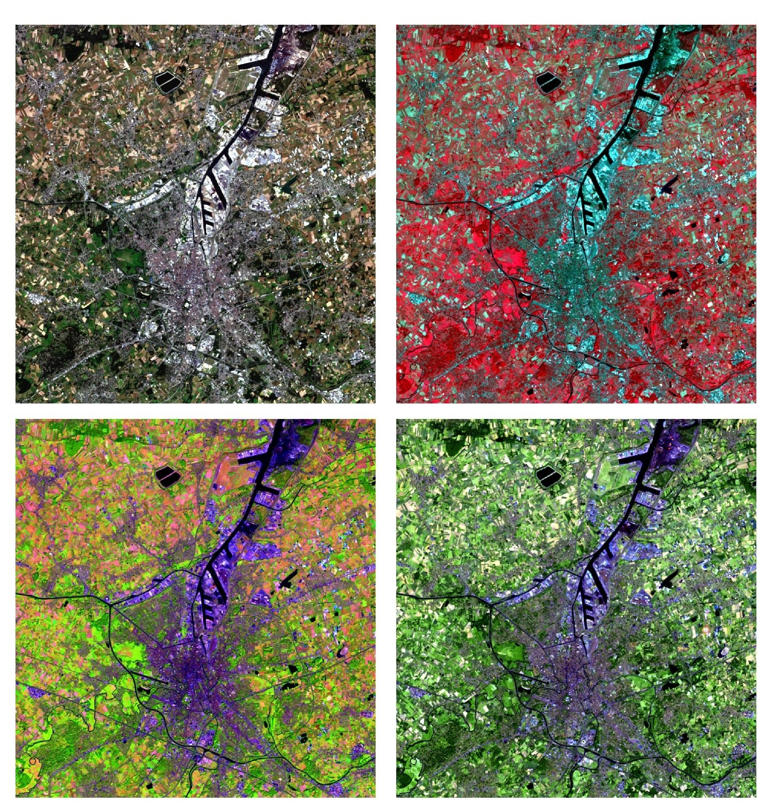

# Over deze cursussite

   

  

 

## Over deze cursus

Welkom bij de cursussite voor de practica van Teledetectie 2022. Deze cursus is ontworpen om studenten te basis aan te leren voor het verkrijgen, voorverwerken, analyseren en exporteren van remote sensing data.

Volgende topics komen doorheen de 5 practica's aan bod:  

- **Practicum 1**: Downloaden en beeldinterpretatie
- **Practicum 2**: Intro Google Earth Engine  
- **Practicum 3**: *Feature* extractie  
- **Practicum 4**: Beeldclassificatie
- **Practicum 5**: Tijdserieanalyse
- **Practicum 6**: Intro tot Synthetic Apperture Radar (SAR)

Deze cursussite laat toe om snel stukken scripts te kopiëren, om zo vlotte gang van zaken mogelijk te maken. In een 'tutorial' leer je bepaalde functionaliteit kennen door het copy-pasten van de voorbeeldscripts. In de hierop volgende oefeningen zul je zelf de gebruikte tools moeten toepassen.

Doorheen de practica wordt deze site aangevuld met nieuwe documentatie, extra informatie en FAQ's.

## Afrukbare PDF's

Afdrukbare pdf's per practicum worden voorzien, voor wie hieraan de voorkeur geeft. De PDF-versie van de volledige practicasite is te vinden via [deze link](https://users.ugent.be/~jfeyen/pdf/document.pdf).

    

 Remote Sensing | Spatial Analysis lab (REMOSA) 
     

  
     

 
